---
tags:
- cypress
- cadence
- pcb
title: "Cadence Walkthrough: PSoC 4 BLE Module"
---

## Introduction

This Cadence walkthrough goes through the process of creating a PSoC® 4 BLE module schematic symbol and PCB footprint.

## Step 1: Find part information in datasheets

1.  Download the PSoC® 4 BLE module data sheet from the [Cypress website](http://www.cypress.com/file/140711/download). You will need the pin names in Step 2.
2.  Download the [PSoC® 4 BLE module mechanical drawing](https://drive.google.com/open?id=0ByRWb7dgVD-rLUNBdGoyRTJsek0). You will need the dimensions in Step 3.

## Step 2: Create the custom schematic symbol

1.  In Windows, open "Capture CIS"

2.  [Create a custom library](creating-a-custom-library-in-cadence.html)

3.  Right-click on your custom library and choose "New Part" (see Figure 1). The New Part Properties window will appear (see Figure 2).

  ------------------------------------------------------------------------------
   [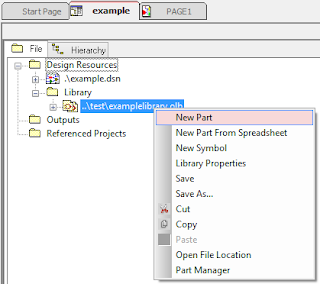{class="img-fluid"}](larger/image0012.png)
               Figure 1: Creating a new part in your custom library
  ------------------------------------------------------------------------------

  ------------------------------------------------------------------------------
   [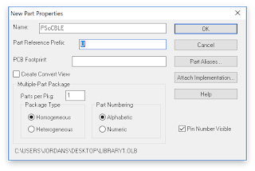{class="img-fluid"}](larger/image0013.png)
                       Figure 2: New Part Properties window
  ------------------------------------------------------------------------------

4.  In the New Part Properties window (see Figure 2), name the part and click OK. The new part creation window will appear (see Figure 3).

  ------------------------------------------------------------------------------
   [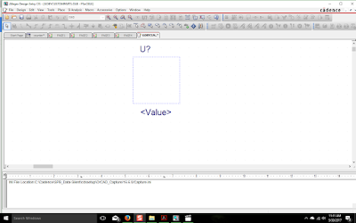{class="img-fluid"}](larger/image0014.png)
                        Figure 3: New part creation window
  ------------------------------------------------------------------------------

5.  Click the "Place pin array" button in the toolbar (see Figure 4). The "Place Pin Array" configuration window will appear (see Figure 5).

  ------------------------------------------------------------------------------
   [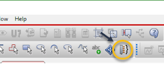{class="img-fluid"}](larger/image0015.png)
                          Figure 4: Place pin array tool
  ------------------------------------------------------------------------------

  ------------------------------------------------------------------------------
   [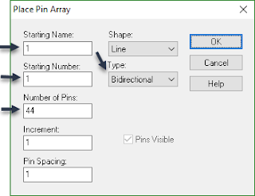{class="img-fluid"}](larger/image0016.png)
                  Figure 5: Place Pin Array configuration window
  ------------------------------------------------------------------------------

6.  Complete the configuration as shown in Figure 5 and click OK.

**Pro Tip:** Instead of configuring Place Pin Array as shown in Figure 5, repeat this step twice: Once for the first 20 pins, and a second time for the remaining 24 pins. This will eliminate the need to move pins from one side of the symbol to the other.

7.  Place the pins on the symbol. You may need to adjust the size of the dotted rectangle in.

8.  Click the "Place rectangle" button in the toolbar (See Figure 6) and add a rectangle box along the dotted lines inside the pins (see Figure 7).

  -----------------------------------------------------------------------------
   [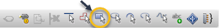{class="img-fluid"}](larger/image0017.png)
                         Figure 6: Place rectangle tool
  -----------------------------------------------------------------------------

  ----------------------------------------------------
   [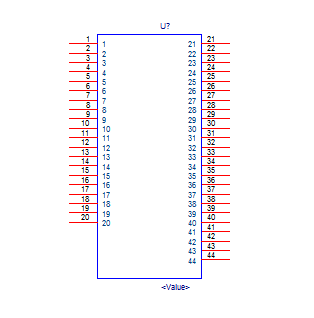{class="img-fluid"}](larger/image0018.png)
   Figure 7: Schematic symbol with pins and rectangle
  ----------------------------------------------------

8.  Double-click on each pin individually to show the Pin Properties window (see Figure 8). Configure each pin according to the pin names in the [PSoC® 4 BLE module datasheet](http://www.cypress.com/file/140711/download). Table 1 shows the basic pin types for each of the pins on the PSoC® 4 BLE module.

  ------------------------------------------------------------------------------
   [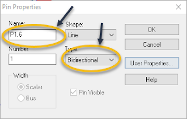{class="img-fluid"}](larger/image0019.png)
                         Figure 8: Pin Properties window
  ------------------------------------------------------------------------------

**Pin Name**

**Pin Type**

All GPIO pins

Bidirectional

VDDD, VDDA, VDDR, and all GNDs

Power

XRES

Input

VREF

Output

Table 1: Pin types for the PSoC® 4 BLE module

9.  The final custom schematic symbol is shown in Figure 9

  ------------------------------------------------------------------------------
   [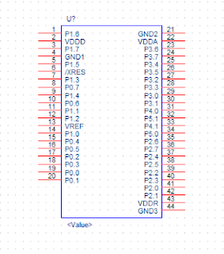{class="img-fluid"}](larger/image0020.png)
        Figure 9: Final custom schematic symbol for the PSoC® 4 BLE module
  ------------------------------------------------------------------------------

10. Save the symbol to your library by right-clicking on the symbol editor tab and choose "Save" (see Figure 10).

  ------------------------------------------------------------------------------
   [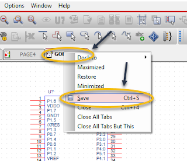{class="img-fluid"}](larger/image0021.png)
                      Figure 10: Saving the schematic symbol
  ------------------------------------------------------------------------------

11. You have successfully created a custom schematic symbol for the PSoC® 4 BLE module that you can now use in your schematic. You can continue creating the remainder of your schematic now and make the PCB footprint later, or continue with this tutorial to create the footprint now.

## Step 3: Create the custom PCB padstack

The custom PCB padstack definition includes mechanical dimensions for the copper pads and the hole to be drilled in the board for each pin in the custom PCB footprint that you will design in Step 4.

1.  In Windows, open "Padstack Editor"

2.  Choose File > New... The New Padstack window appears (see Figure 11).

  ------------------------------------------------------------------------------
   [{class="img-fluid"}](larger/image0022.png)
                          Figure 11: New Padstack window
  ------------------------------------------------------------------------------

3.  In the "New Padstack" window (see Figure 11), click "Browse..." and select the location of your custom symbols folder (e.g., Desktop/Cadence/symbols)

4.  In the "New Padstack" window (see Figure 11), enter a pad stack name of pad70cir40d_AB (where AB are your initials) and click OK.

5.  On the "Start" tab, configure the parameters to match Figure 12 below.

  ------------------------------------------------------------------------------
   [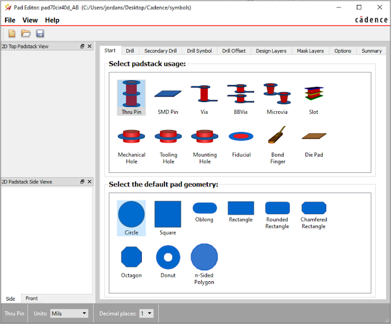{class="img-fluid"}](larger/image0023.png)
                        Figure 12: Start tab configuration
  ------------------------------------------------------------------------------

6.  Click on the "Drill" tab and configure the parameters to match Figure 13 below.

  ------------------------------------------------------------------------------
   [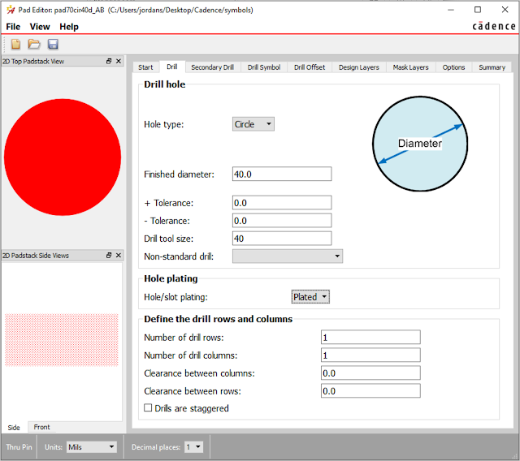{class="img-fluid"}](larger/image0024.png)
                        Figure 13: Drill tab configuration
  ------------------------------------------------------------------------------

7.  Do not change any settings on the "Secondary Drill" tab. Click on the "Drill Symbol" tab and configure the parameters to match Figure 14 below.

  ------------------------------------------------------------------------------
   [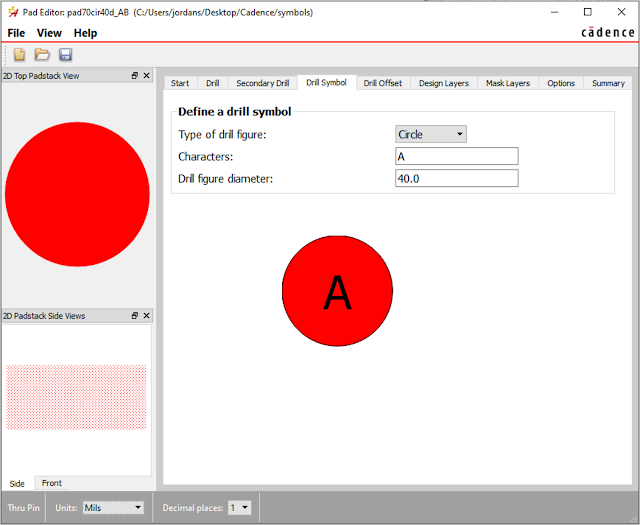{class="img-fluid"}](larger/image0025.png)
                    Figure 14: Drill Symbol tab configuration
  ------------------------------------------------------------------------------

8.  Do not change any settings on the "Drill Offset" tab. Click on the "Design Layers" tab and configure the parameters to match Figure 15 below.

  ------------------------------------------------------------------------------
   [{class="img-fluid"}](larger/image0026.png)
                    Figure 15: Design Layers tab configuration
  ------------------------------------------------------------------------------

9.  Click on the "Mask Layers" tab and configure the parameters to match Figure 16 below.

  ------------------------------------------------------------------------------
   [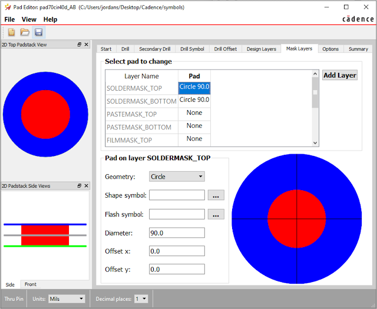{class="img-fluid"}](larger/image0027.png)
                     Figure 16: Mask Layers tab configuration
  ------------------------------------------------------------------------------

10. Do not change any settings on the "Options" tab. Click on the "Summary" tab and confirm that your padstack matches [this example](https://drive.google.com/file/d/1TDb6ff3U5i5ZXvcrdE5s5MCJ7vWOGRdd/view?usp=sharing).

11. Choose File > Save  and close "Padstack Editor"

## Step 4: Create the custom PCB footprint

1.  In Windows, open "PCB Editor"

2.  Choose File > New... The "New Drawing" window appears (see Figure 17).

  ------------------------------------------------------------------------------
   [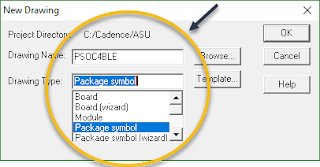{class="img-fluid"}](larger/image0028.png)
                          Figure 17: New Drawing window
  ------------------------------------------------------------------------------

3.  In the "New Drawing" window (see Figure 17), click "Browse..." and select the location of your custom symbols folder (e.g., Desktop/Cadence/symbols). Then, enter a drawing name of your choice. **Do not use spaces in the drawing name.** Choose a "Drawing Type" of "Package symbol" and click OK to return to the empty drawing window.

4.  Next, you need to create the *package geometry* for the footprint. The *package geometry* is a visual representation of the physical dimensions of the part. Click the "Shape Add Rect" button in the toolbar (see Figure 18) and click on the Options tab on the right hand side of the screen. Configure the settings in the Options tab to match those shown in Figure 19. The dimensions of the rectangle and the rounded corners came from the [PSoC® 4 BLE mechanical drawing](https://drive.google.com/file/d/0ByRWb7dgVD-rLUNBdGoyRTJsek0/view?usp=sharing).

  ----------------------------------------------------
   [{class="img-fluid"}](larger/image0029.png)
             Figure 18: Shape Add Rect tool
  ----------------------------------------------------

  ------------------------------------------------------------------------------
   [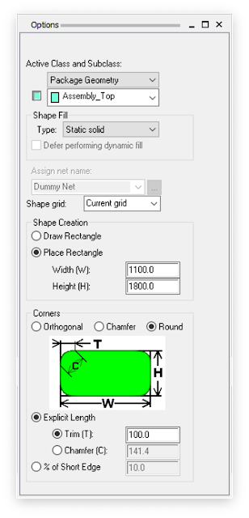{class="img-fluid"}](larger/image0030.png)
                Figure 19: Options tab for the Shape Add Rect tool
  ------------------------------------------------------------------------------

5.  Click in the Command window at the bottom of the screen and enter the coordinates to place the package geometry: x 0 1800. The rounded rectangle package geometry will appear with the lower left corner of the window at (0,0) and the upper right corner at (1100,1800) (see Figure 20).

  ------------------------------------------------------------------------------
   [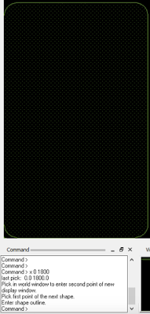{class="img-fluid"}](larger/image0031.png)
                  Figure 20: Package geometry and Command window
  ------------------------------------------------------------------------------

6.  Next, lay out the pads for the left side of the PSoC® module. Choose Layout > Pins and click on the Options tab on the right hand side of the screen. Configure the settings in the Options tab to match those shown in Figure 18.

  ------------------------------------------------------------------------------
   [{class="img-fluid"}](larger/image0032.png)
       Figure 18: Layout > Pins Options tab configured for the left header
  ------------------------------------------------------------------------------

7.  Click in the Command window at the bottom of the screen and enter the coordinates to place the left header: x 180 367 (see Figure 19). This will place pin 1 at (180, 367) on the lower right hand corner of the left header, pin 2 on the lower left hand corner of the header, pin 19 in the upper right hand corner of the header, and pin 20 in the upper left hand corner of the header.

  ------------------------------------------------------------------------------
   [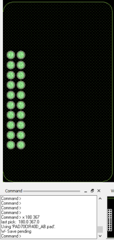{class="img-fluid"}](larger/image0033.png)
              Figure 19: Left header placed using the command prompt
  ------------------------------------------------------------------------------

8.  Click the Options tab again and configure it to match the settings shown in Figure 20. Note the updated values for the Y Qty, X and Y Order, and Pin #.

  ------------------------------------------------------------------------------
   [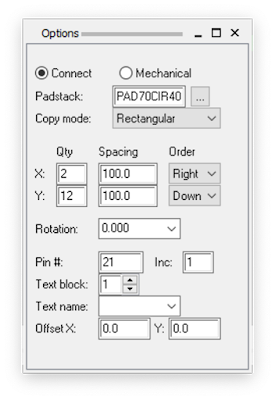{class="img-fluid"}](larger/image0034.png)
      Figure 20: Layout > Pins Options tab configured for the right header
  ------------------------------------------------------------------------------

9.  Click in the Command window at the bottom of the screen and enter the coordinates to place the right header: x 920 1267 (see Figure 21). This will place pin 21 at (920, 1267) in the upper left hand corner of the right header, pin 22 in the upper right hand corner of the header, pin 43 in the lower left hand corner of the header, and pin 44 in the lower right hand corner of the header.

  ------------------------------------------------------------------------------
   [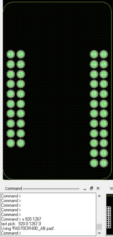{class="img-fluid"}](larger/image0035.png)
           Figure 21: Right hand header placed using the command prompt
  ------------------------------------------------------------------------------

10. Next, you need to give the footprint a *reference designator* that matches the reference designator in your custom schematic symbol (typically U). Click the "Label Refdes" button in the toolbar (see Figure 22) and click on the Options tab on the right hand side of the screen. Configure the settings in the Options tab to match those shown in Figure 23.

  ----------------------------------------------------
   [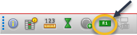{class="img-fluid"}](larger/image0036.png)
              Figure 22: Label Refdes tool
  ----------------------------------------------------

  ------------------------------------------------------------------------------
   [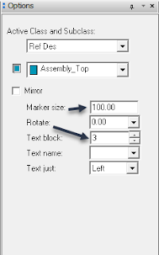{class="img-fluid"}](larger/image0037.png)
                 Figure 23: Options tab for the Label Refdes tool
  ------------------------------------------------------------------------------

11. Click on or around the part and type U* (see Figure 24). The * will be replaced with the part number assigned in the schematic (e.g., U1).

  ------------------------------------------------------------------------------
   [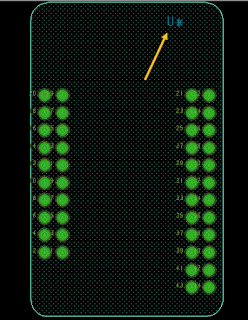{class="img-fluid"}](larger/image0038.png)
                  Figure 24: Footprint with reference designator
  ------------------------------------------------------------------------------

12. Close PCB Editor and save changes

## Step 5: Link the Custom PCB Footprint to the Custom Schematic Symbol

1.  Open a schematic that uses the custom symbol in Capture CIS.

2.  In your schematic, double-click on the placed custom symbol. The Property Editor window will open (see Figure 25).

  ------------------------------------------------------------------------------
   [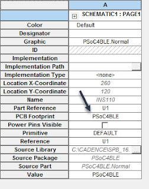{class="img-fluid"}](larger/image0039.png)
             Figure 25: Property Editor window for PSoC® 4 BLE module
  ------------------------------------------------------------------------------

3.  Type the filename for the footprint into the "PCB Footprint" field and close the Property Editor window.

4.  To confirm that the footprint was properly linked to the custom schematic symbol, right-click on the part in the schematic and select "Show Footprint". The "Footprint Viewer" window will open and show the footprint (see Figure 26).

  ------------------------------------------------------------------------------
   [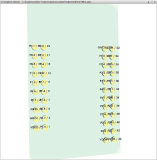{class="img-fluid"}](larger/image0040.png)
     Figure 26: Footprint successfully linked to the custom schematic symbol
  ------------------------------------------------------------------------------

If the footprint does not show up, confirm that the name of the footprint in the Property Editor matches the filename of the footprint, and that the symbols folder is [configured correctly in Cadence](configuring-cadence.html).

The following video shows the process described in this tutorial from start to finish. Note that the Cadence interface has changed for padstack editing since the time the video was created.

*Based on a video and tutorial created by Robert Goby*
