---
tags:
- custom part
- cadence
title: Creating a Custom DC Barrel Jack Schematic Symbol and PCB Footprint in Cadence
---

Creating a Custom DC Barrel Jack Schematic Symbol and PCB Footprint in Cadence (Includes Padstack Tutorial)

For this tutorial, we will utilize the [PRT-10811](https://www.sparkfun.com/products/10811) breadboard-compatible DC barrel jack adapter sold by Sparkfun, and will be referring to its product drawing found [here](http://cdn.sparkfun.com/datasheets/Prototyping/18742.pdf) .

Part 1: Creating a Barrel Jack Schematic Symbol

1.  Open Capture CIS. You can optionally create a new project, design, and/or library, or you can use an existing library.

2.  Right click your library and select "New Part".

3.  Name the part and set the part reference prefix to J, as shown. Leave the PCB Footprint field blank (unless you did part 2 first, then use the name of the footprint).

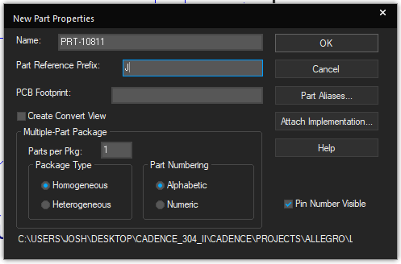{class="img-fluid"}

4.  Open up the product drawing for the barrel jack adapter. Note the "Circuit Diagram" section on the left with the pins numbered 1, 3, 2. We will be drawing this symbol by hand in Cadence.

5.  Place the three pins spaced out vertically with their numbers, positions, and names according to the drawing.

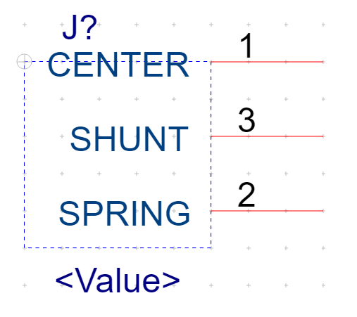{class="img-fluid"}

6.  Enlarge the bounding box by clicking on it and then dragging the pink corner handles. Then, space the pins out farther. Since drawn shapes will have their vertices snapped to the grid of dots we can see in the background, we will need some extra space to make this symbol.

{class="img-fluid"} {class="img-fluid"}

7.  Select the line tool (top of the shapes toolbar). Draw a series of lines representing the tip spring, as shown in the drawing. After drawing one line segment, you can begin another at the endpoint of the previous line.

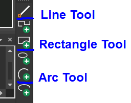{class="img-fluid"}

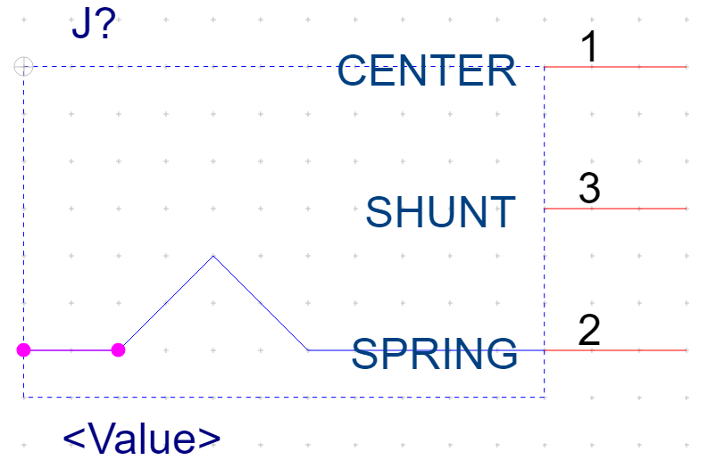{class="img-fluid"}

8.  Draw more lines representing the shunt terminal, as pictured. The arrow is imitated with two lines forming an angle pointing downward.

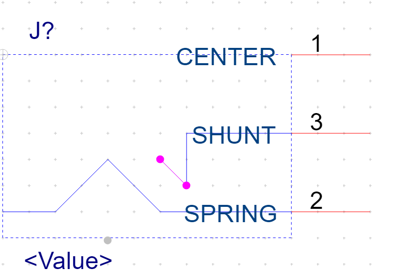{class="img-fluid"}

9.  Start drawing the center terminal with a single, short straight line.

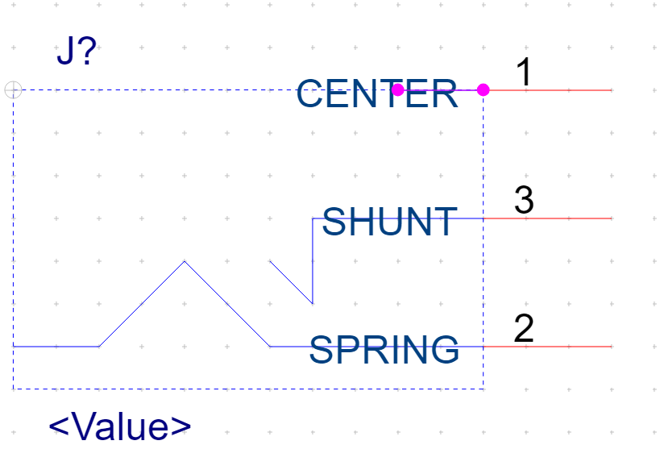{class="img-fluid"}

10. Select the rectangle tool (second from the top of the shapes toolbar). Draw a rectangle, 1 wide and 4 tall, centered at the left end of this line.

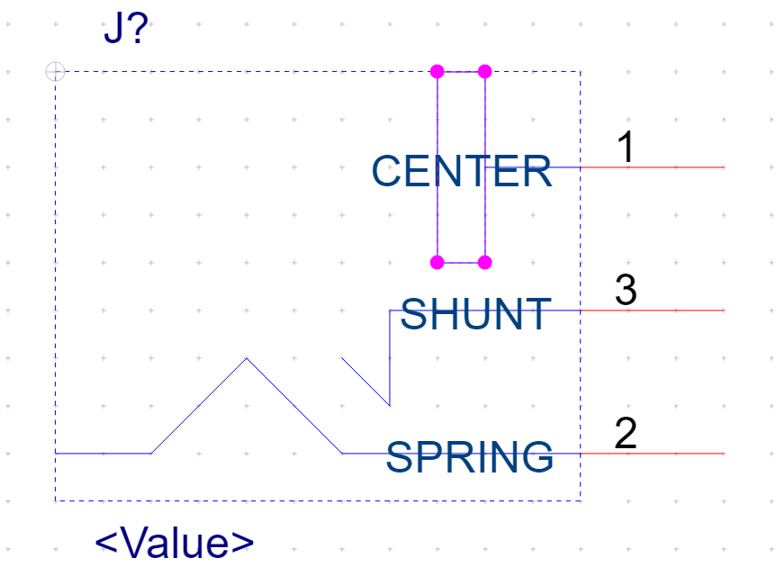{class="img-fluid"}

11. Draw two straight horizontal lines, one above the center of the rectangle and one below.

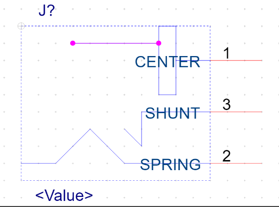{class="img-fluid"} 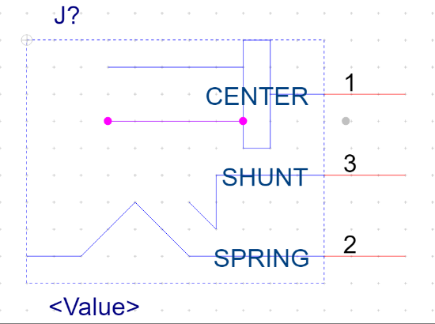{class="img-fluid"}

12. Select the Arc tool now (second from the bottom of the shape toolbar shown). Click first the left end of the top line, then the space between the lines and one to the left, then the left end of the bottom line. This will cap off the center terminal.

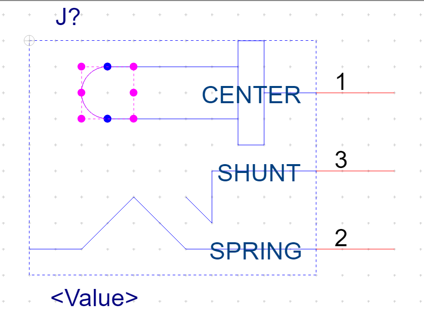{class="img-fluid"}

13. Move the pin names so they don't overlap the symbol. If desired or needed, readjust the positions of the lines/shapes slightly.

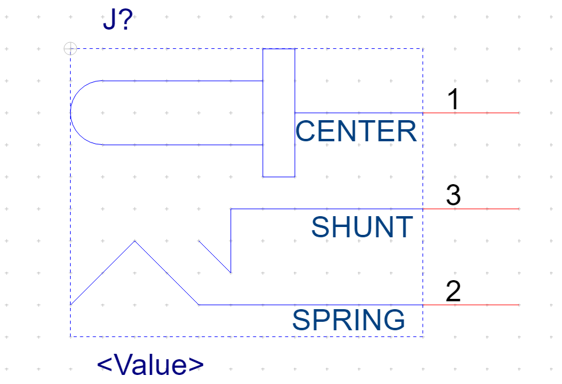{class="img-fluid"}

14. You now have a barrel jack schematic symbol. Nice work!

Part 2: Creating a Barrel Jack PCB Footprint

Creating the Padstack

1.  Open up Padstack Editor. Select Thru-Pin for padstack usage, Circle for pad geometry.

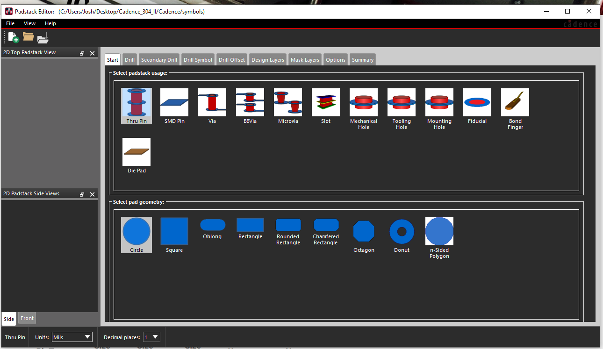{class="img-fluid"}

2.  Look at the dimensions in the drawing under "Recommended P.C.B. Layout". The pins aren't circular, so you'll want the drill hole to be the size of the longest dimension plus tolerances (1.6+0.3=1.9 mm -> 74.8 mils) to ensure it isn't too small. Consult the [PCB Mill Specs](https://peraltastudios.engineering.asu.edu/pcb-mill-specs/) and round up to the nearest drill size for the drill diameter.

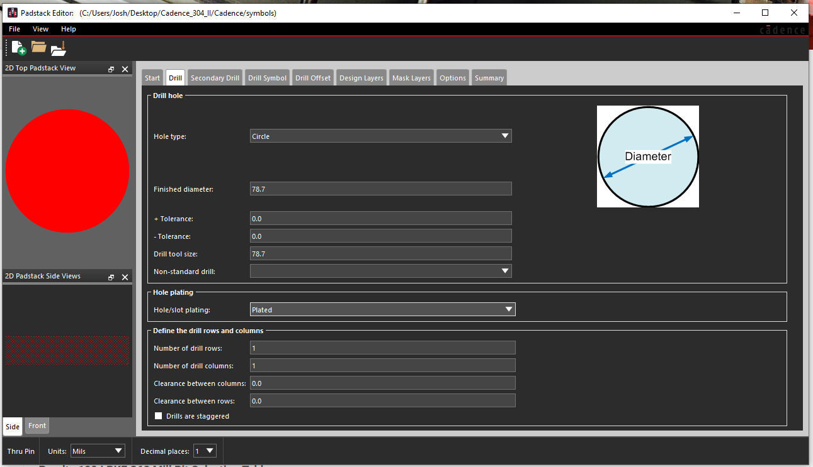{class="img-fluid"}

3.  Define a drill symbol with the same radius as your drill hole.

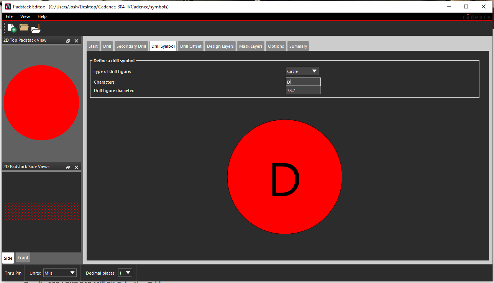{class="img-fluid"}

4.  Select your regular pad size. You'll want one that guarantees sufficient annular ring and allows adequate clearance between pins. Annular ring can be calculated using the following equation from ProtoExpress.com (read more about annular ring [there](https://www.protoexpress.com/blog/dont-let-annular-rings-drive-you-crazy/) ).

Annular ring width = (Diameter of the pad - Diameter of the finished hole) / 2

According to this equation, a pad diameter of 100 is sufficient for the minimum annular ring of 10 needed to satisfy Peralta's DFM constraints. 128 was chosen for this example as this value results in a larger annular ring yet is still small enough to avoid pin overlap when used in its intended footprint.

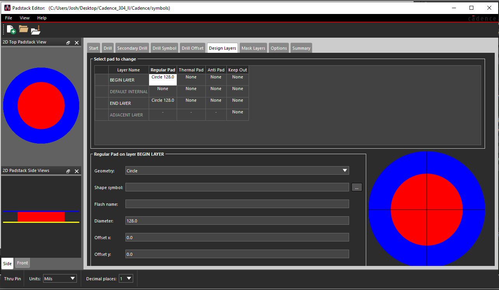{class="img-fluid"}

5.  Select an anti pad and thermal pad size approximately 20 mils larger than the size of the regular pad.

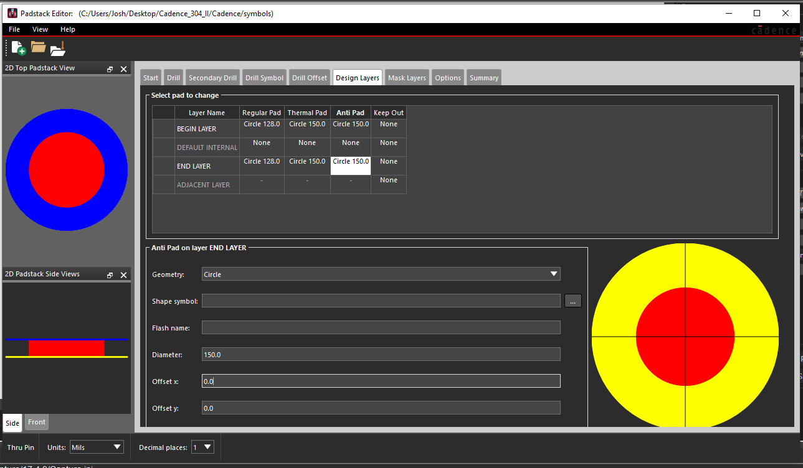{class="img-fluid"}

6.  Add default internal layers identical to the outer layers, so the program doesn't give you an error when saving. As a shortcut, you can actually drag your cursor across a row so the three pads' settings are selected together and then copy and paste this row into other layers.

7.  Define the soldermask layers with a radius about 20 mils larger than the thermal/anti pads.

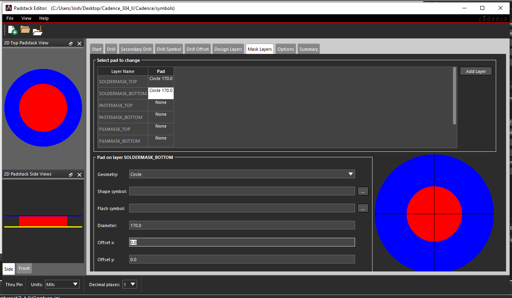{class="img-fluid"}

8.  Save the padstack with a memorable enough name to find it in the list later. Make sure to use the Save button in the file menu, not the one on the Summary page (which only saves the summary).

Creating the Footprint

1.  Open PCB Editor, create a new drawing, enter the name you'll use for your PCB footprint, and select "Package symbol".

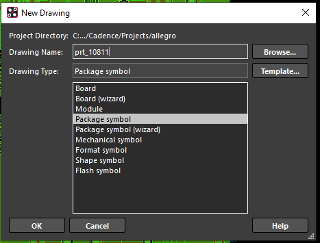{class="img-fluid"}

2.  Reset the origin so it's somewhere you can see it. To do this, zoom in really far, then go to Setup -> Change Drawing Origin and click the center of the screen. If no errors about drawing extents appear in the command window and you can see the origin, you're good, if not re-adjust the zoom and try again.

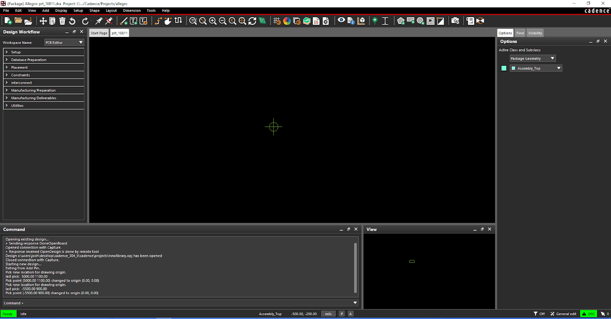{class="img-fluid"}

3.  Click the "Place Pin" button to start placing your pins. Select the correct padstack, then place pin 1 at the drawing origin. You can do this either by simply clicking the origin, or by typing x 0 0 into the command window to select (0, 0) as the coordinates for this operation.

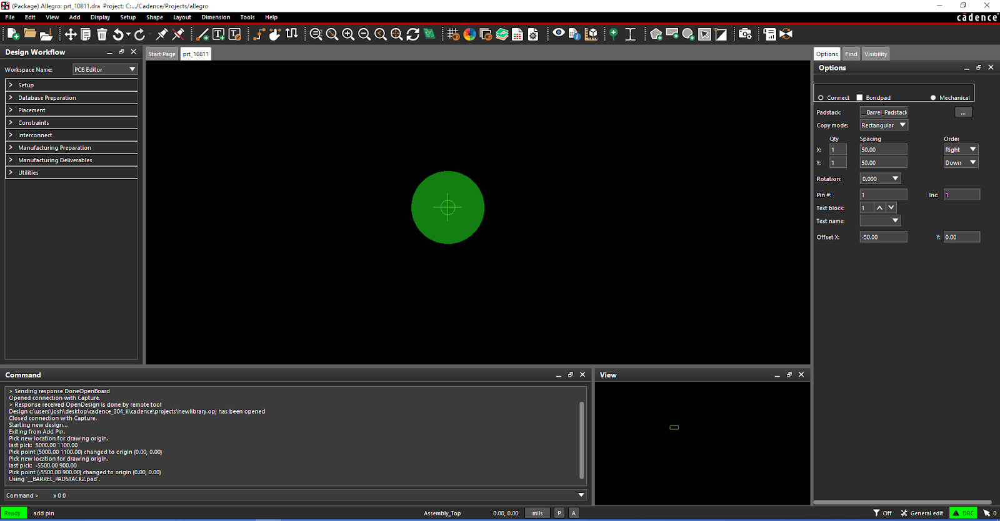{class="img-fluid"}

4.  To determine the placement of pin 2, refer to the dimensions given in the drawing. Pin 1 is 13.6 mm to the right of the front of the physical package, while pin 2 is 7.8 mm to the right of the same edge. This means that the distance between them is (13.6 - 7.8) == 5.8 mm. Since pin 2 is to the left of pin 1, we put a negative sign on the number, and we need to convert to mils . Mils = mm *39.37, so 5.8 mm * 39.37 =228.3 mils (to one decimal place).

So the coordinates of pin 2 are (-228.3, 0). Use the command x -228.3, 0 to place pin 2 precisely at this point.

5.  Use the dimensions to place pin 3. The distance of pin 3 to the edge of the barrel jack is 10.6 mm, so to find its x-position relative to pin 1, 10.6 - 13.6 = -3mm = -118.1 mils. The y-distance is stated as 4.8 mm down (negative in our coordinate system) which rounds up to 189 mils.

Thus, use x -118.1 -189 to place pin 3.

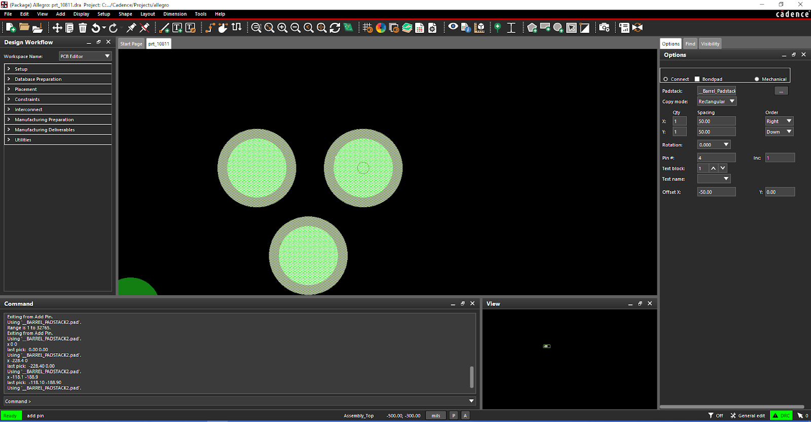{class="img-fluid"}

6.  Place the reference designator. Click the button shaped like a capital I or a text cursor next to the Place Pin button to enter the correct mode.

{class="img-fluid"}

Click where you want the text, type J* and then hit enter. The reference designator will then appear.

7.  Add the package outline. This is a critical step to ensure the barrel jack will be oriented correctly in your PCB layout. {class="img-fluid"}

Click the Add Rectangle tool, two to the right of the Reference Designator button. Using the drop-down menus on the right, make sure Active Class and Subclass are Package Geometry and Assembly_Top, respectively.

The dimensions for this rectangle come from the width and length of the barrel jack stated in the drawing. Note that the jack is pointing to the left, so the width of our rectangle will be the length from the drawing (14.5 mm = 570.9 mils), the height of our rectangle will be the width from the drawing (9 mm = 354.3 mils), and it will be placed on the left side.

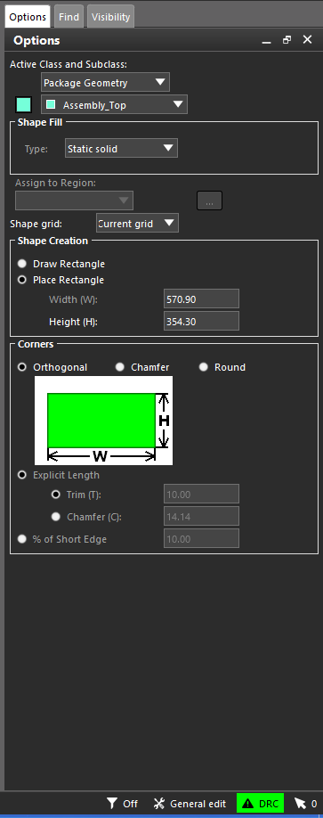{class="img-fluid"}

From the drawing, the origin of this rectangle would be 13.6 mm to the left of pin 1, and 4.5 mm above. Converting these to mils, the coordinates are (-535.4, 177.2). So type x -535.4 177.2 to place the rectangle at that location.

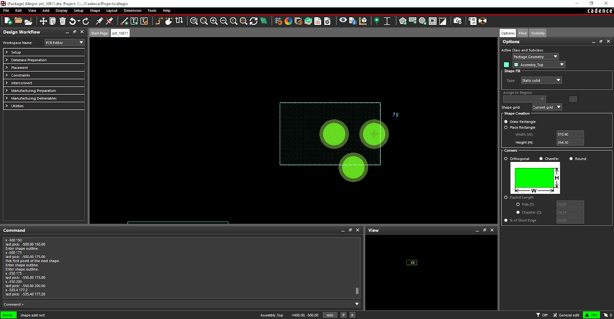{class="img-fluid"}

You now have a barrel jack footprint!

Based on a post written by Joshua Weight
