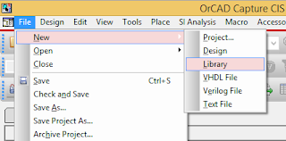
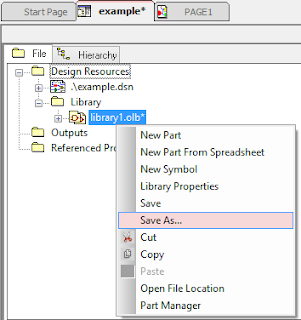
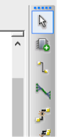
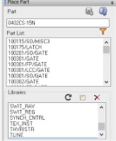

---
tags:
- tutorial
- cadence
- custom part
title: Creating a custom library in Cadence
---

In order to use schematic symbols imported from the web or custom created for your project (very common), you must create a custom symbol library in which to save them. It is good practice to create a custom library for each project that you work on to save your schematic symbols. To create a custom library, do the following:

1.  With your project open, choose "File > New > Library". This will create a new library with a default name under Design Resources in the project.

[{class="img-fluid"}](larger/image0079.png)

2.  Right-click on the new library and choose "Save As..." You will be prompted to enter a name and choose a location for the custom library. Save the custom library in the same folder as your project files.

[{class="img-fluid"}](larger/image0080.png)

3.  Add the custom library to your project by clicking the "Place Part" tool in the toolbar. Then, click the "Add Library" button (which looks like a dotted square with a yellow corner) and locate the library file that you saved in the previous step (it will likely be in a different location than the pre-installed libraries). Click "Open" to add the library to the list of active libraries.

  -----------------------------------------------------------------------------
   [{class="img-fluid"}](larger/image0081.png)
                        Place Part tool (second from top)
  -----------------------------------------------------------------------------

  ------------------------------------------------------------------------------
   [{class="img-fluid"}](larger/image0082.png)
              Add Library button (dotted square with yellow corner)
  ------------------------------------------------------------------------------

4.  To create a new part in the custom library, right-click on the library and choose "New Part". More information on creating custom parts can be found on the [Creating a Custom Schematic Symbol in Cadence page](creating-a-custom-schematic-symbol-in-cadence.html).

-   
-   

*Based on a tutorial by Cody Van Cleve*
