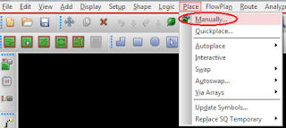
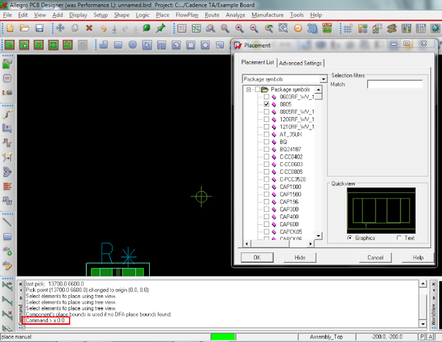
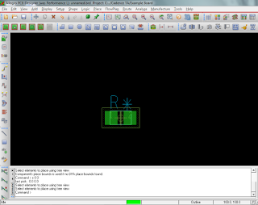
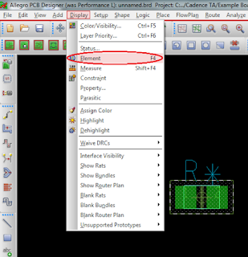
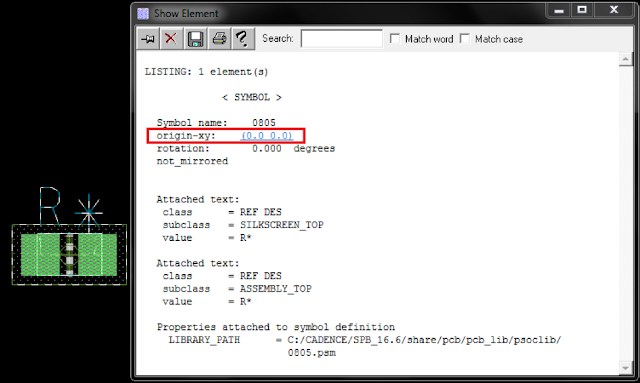
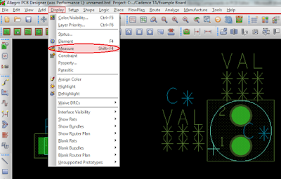
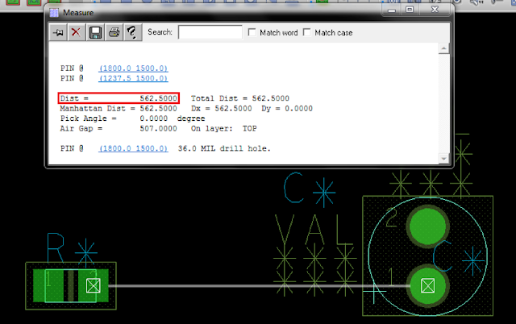
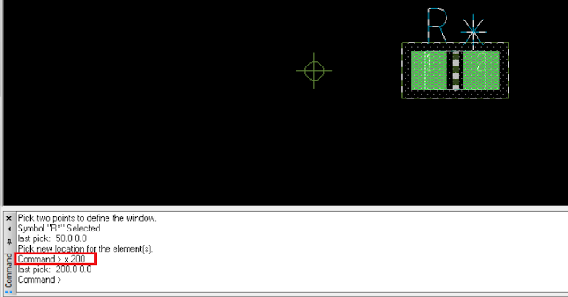
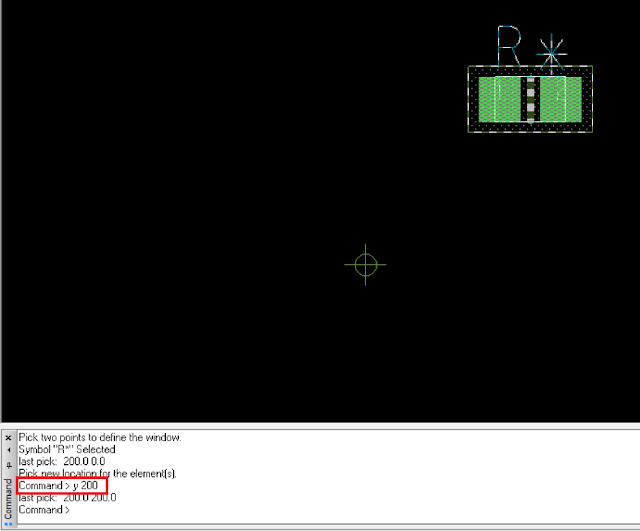
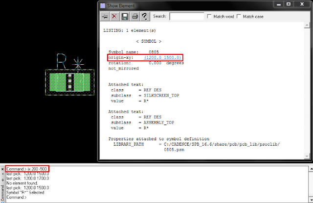

---
tags:
- cadence
- pcb
title: Placing and moving components in Cadence PCB Editor
---

While it is easy to place components using the mouse, most designs require precise placement of some components (e.g., to align parallel headers). This tutorial walks through how to place components at a specific X-Y coordinate, determine the X-Y coordinates of a component, measure the distance between two components, move an existing component to a specific X-Y coordinate, and move an existing component relative to its current location.

## How do you place a component at a specific X-Y coordinate?

1.  Choose Place > Manually... (see Figure 1). The Placement dialog box appears (see Figure 2).

  ------------------------------------------------------------------------------
   [{class="img-fluid"}](larger/image0194.png)
                       Figure 1: Place > Manually... menu
  ------------------------------------------------------------------------------

  ------------------------------------------------------------------------------
   [{class="img-fluid"}](larger/image0195.png)
                          Figure 2: Placement dialog box
  ------------------------------------------------------------------------------

2.  Check the box next to the part that you want to place, but **do not place it yet**. Instead, go to the command line at the bottom of the screen and type the desired placement coordinates in the following format: x x-coordinate y-coordinate

*Example:*

Command > x 0 0 will place the component at the origin (0,0)

3.  Press *Enter* to place the component at the desired coordinates (see Figure 3).

  ------------------------------------------------------------------------------
   [{class="img-fluid"}](larger/image0196.png)
                    Figure 3: Component placed at origin (0,0)
  ------------------------------------------------------------------------------

## How do you determine the current coordinates of a component?

1.  Choose Display > Element (see Figure 4) and click on the component you would like to examine. The Show Element dialog box will appear and show the current coordinates of the component (see Figure 5).

  ------------------------------------------------------------------------------
  [{class="img-fluid"}](larger/image0197.png)
  Figure 4: Display > Element menu option
  ------------------------------------------------------------------------------

  ------------------------------------------------------------------------------
  [{class="img-fluid"}](larger/image0198.png)
  Figure 5: Coordinates of a placed component
  ------------------------------------------------------------------------------

## How do you measure the distance between two components?

1.  Choose Display > Measure (see Figure 6). The command line will ask you to "Make two picks for the distance calculator" (see Figure 7).

  ------------------------------------------------------------------------------
   [{class="img-fluid"}](larger/image0199.png)
                     Figure 6: Display > Measure menu option
  ------------------------------------------------------------------------------

  -----------------------------------------------------------------------------
   [{class="img-fluid"}](larger/image0200.png)
                 Figure 7: Command line message for Measure tool
  -----------------------------------------------------------------------------

2.  Click parts of two components (e.g., a pin of a resistor and a pin of a capacitor). The Measure dialog box will appear and show the distance between the selected points (see Figure 8).

  ------------------------------------------------------------------------------
   [{class="img-fluid"}](larger/image0201.png)
         Figure 8: Measured distance between resistor and capacitor pins
  ------------------------------------------------------------------------------

## How do you move an existing component to a specific  X-Y coordinate?

1.  Right-click on the component and select "Move"

2.  Use the command line to enter a specific coordinate in the x (x x-coordinate) or y (y y-coordinate) direction.

*Examples:*

A component is at (25,75).

Command > x 200 will move the component to (200,75) (see Figure 9)

Command > y 200 will move the component to (25, 200) (see Figure 10)

  ------------------------------------------------------------------------------
   [{class="img-fluid"}](larger/image0202.png)
             Figure 9: Moving a component to an absolute x coordinate
  ------------------------------------------------------------------------------

  ------------------------------------------------------------------------------
   [{class="img-fluid"}](larger/image0203.png)
            Figure 10: Moving a component to an absolute Y coordinate
  ------------------------------------------------------------------------------

## How do you move a component relative to its current position?

1.  Right-click on the component and select "Move"

2.  Use the command line to enter a relative movement in one of the following formats:

ix x-units

iy y-units

ix x-units y-units

*Examples:*

A component is at (1000,2000).

Command > ix 200 will move the component to (1200, 2000)

Command > iy 200 will move the component to (1000, 2200)

Command > ix 200 -500 will move the component to (1200,1500) (see Figure 11)

+:----------------------------------------------------------------------------:+
| [{class="img-fluid"}](larger/image0204.png) |
+------------------------------------------------------------------------------+
| Figure 11: Results of relative movement                                      |
|                                                                              |
| *Based on a tutorial by Seana O'Reilly*                                      |
+------------------------------------------------------------------------------+
