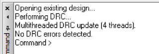
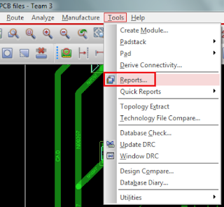
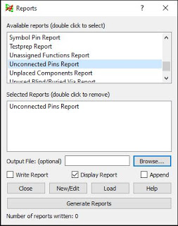
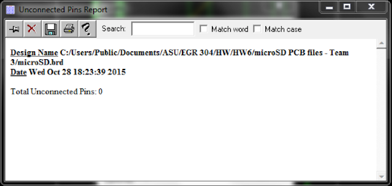

---
tags:
- cadence
- pcb
title: Running Design Rules Check in Cadence PCB Editor
---

## What is a Design Rules Check?

Design Rules Check (DRC) is a tool that looks for a limited set of errors in PCB designs, and generates error messages to help you identify and fix the problem(s). A design that passes a DRC is not necessarily error-free, but rather has passed the limited set of tests that DRC conducts. You can (and should) run a DRC in both Design Entry CIS and PCB Editor, and they will look for different types of errors.

## How do you run a Design Rules Check in PCB Editor?

1.  In PCB Editor, choose Tools > Update DRC (see Figure 1).

  ------------------------------------------------------------------------------
   [{class="img-fluid"}](larger/image0230.png)
                         Figure 1: Update DRC menu option
  ------------------------------------------------------------------------------

2.  If no DRC errors are detected, then the command window at the bottom of the screen will look similar to Figure 2. If errors appear in the command window, it is recommended that you correct them prior to continuing with your design.

  ------------------------------------------------------------------------------
   [{class="img-fluid"}](larger/image0231.png)
            Figure 2: Error-free command window after a DRC operation
  ------------------------------------------------------------------------------

## How do you check for unconnected pins in PCB Editor?

1.  In PCB Editor, choose Tools > Reports... (see Figure 3). The "Reports" dialog box will appear (see Figure 4).

  ------------------------------------------------------------------------------
   [{class="img-fluid"}](larger/image0232.png)
                          Figure 3: Reports menu option
  ------------------------------------------------------------------------------

2.  In the "Reports" dialog box under "Available Reports, select"Unconnected Pins Report"and click"Generate Reports" (see Figure 4).

  ------------------------------------------------------------------------------
   [{class="img-fluid"}](larger/image0233.JPG)
                           Figure 4: Reports dialog box
  ------------------------------------------------------------------------------

3.  If no unconnected pin errors are detected, then the Unconnected Pins Report will look similar to Figure 5. If errors appear in the report, it is recommended that you correct them prior to continuing with your design.

  ------------------------------------------------------------------------------
   [{class="img-fluid"}](larger/image0234.png)
                        Figure 5: Unconnected Pins Report
  ------------------------------------------------------------------------------
