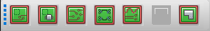

In the hopes that it will help anyone that is still working on the PCB, here is a list of the steps needed for this homework assignment with the corresponding blog posts and some of my comments. I also added some links at the bottom for specific errors I have seen mentioned so far. Please comment if there are any parts of the process that you would like more details on and I will try to add to this post.

## 1. Create footprints for ALL components

Cadence will not automatically add footprints for any components, including default ones. It is usually easiest just to create them yourself. I would recommend using the symbol wizard as detailed here: [Creating PCB Footprint using Package Designer in Cadence](/creating-a-custom-pcb-footprint-using-package-designer-in-cadence/)

When creating the drawing, click \"Browse\...\" and make sure it is saving to the symbols folder that you set up. For the drawing name, it is a good idea to use the part number for your component. Make a note of the names you use because you will need them in part 2.

For package type, choose:

-   DIP (Dual inline package) for ICs with two rows of pins
-   SIP (Single inline package) for connectors, headers, or anything else with a single row of pins
-   TH Discrete (Through-hole discrete) for resistors and capacitors

For the reference designator prefix, choose:

-   U for ICs
-   R for resistors
-   C for capacitors
-   J for jumpers/connectors

For size, use the figure on the left as a reference for what the different measurements are. You can get these values by looking at the component datasheet or by manually measuring the component. Remember that the units default to mils, which are 1/1000 of an inch. The holes on a breadboard are 100 mils apart, so you can also use that as a reference for size.

For the padstack, a 65 mil circle with a 35 mil drill is a good default choice (it is in the list as pad65cir35d). For some components with larger leads (such as voltage regulators or terminal blocks) you will need to choose a slightly larger pad. You can check the size for leads by looking at a component's datasheet. If it is close to or larger than 35 mil, choose a different pad with a drill size that is slightly larger than the leads (pad70cir45d, pad75cir51d, etc.).

## 2. Link the footprints to the components and export a netlist

Follow the steps detailed here: [Transferring Cadence Schematic to PCB Editor](/transferring-a-cadence-schematic-to-pcb-editor). For step 3-d, enter the names of the components you created above in the row labeled \"PCB Footprint\". It may be helpful to watch the video walkthrough in addition to reading the post. If your settings in the netlist window match the screenshot, the PCB editor will automatically open when you click ok.

## 3. Place components

Begin placing components as shown in step one of this post: [placing-and-moving-components-in-cadence-pcb-editor](/placing-and-moving-components-in-cadence-pcb-editor)

Add all of the components by either clicking where you want them or by following the instructions in the remainder of the post for using exact coordinates. While placing parts, consider how to arrange them to minimize the complexity of the traces you need to run.

## 4. Run traces

[Manual Routing in Cadence PCB Editor](/manual-routing-in-cadence-pcb-editor)

For line width, something around 30-40 mils should work for most of the boards in this class. This number affects how much current the trace can carry. Remember that right-clicking and selecting "oops" will undo your last action.

## 5. Making adjustments

These buttons in the top left control what you can select and edit. They are useful if you want to adjust component placement or traces without accidentally selecting other components.

## 6. Create a board outline

[creating-a-board-outline-in-cadence-pcb-editor](/creating-a-board-outline-in-cadence-pcb-editor)

You can also select draw rectangle and click two corner points rather than entering a width and height.

## 7. Add ground plane

[creating-a-ground-plane-in-cadence-pcb-editor](/creating-a-ground-plane-in-cadence-pcb-editor)

This may not be necessary for your board, but it is a good practice.

Video walkthrough of process:

<https://www.youtube.com/watch?v=tRAkY6g5NWk>

For search path errors, see:

-   <https://www.youtube.com/watch?v=QyfyskwCqGA>
-   [changing-the-library-search-path-in-cadence-design-entry-cis](/changing-the-library-search-path-in-cadence-design-entry-cis)
-   [changing-the-library-search-path-in-cadence-pcb-editor](/changing-the-library-search-path-in-cadence-pcb-editor)

For licensing issues:

If the PCB editor will not open due to a licensing error, make sure that you have the AnyConnect VPN running. Instructions for installing this can be found here: <https://myapps.asu.edu/app/cisco-ssl-vpn-pc-46x>. This applies whether you are on campus or off campus.

Resources for errors:

-   WARNING: Net has fewer than two connections -- <https://piazza.com/class/jkvd67zs28o4t2?cid=78>
-   ERROR: Property "PCB Footprint" missing from instance -- <https://piazza.com/class/jkvd67zs28o4t2?cid=77>, \#1 above
-   Components not showing up on placement -- <https://piazza.com/class/jkvd67zs28o4t2?cid=64>
-   "Pick is outside the extent of the drawing ... pick again" -- <https://piazza.com/class/jkvd67zs28o4t2?cid=80>
