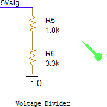
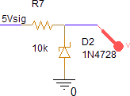
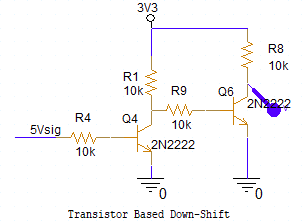
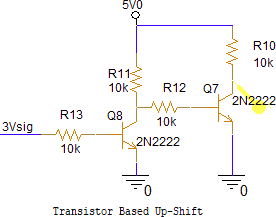
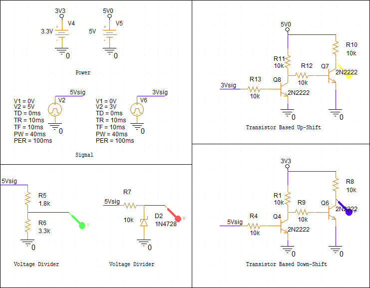
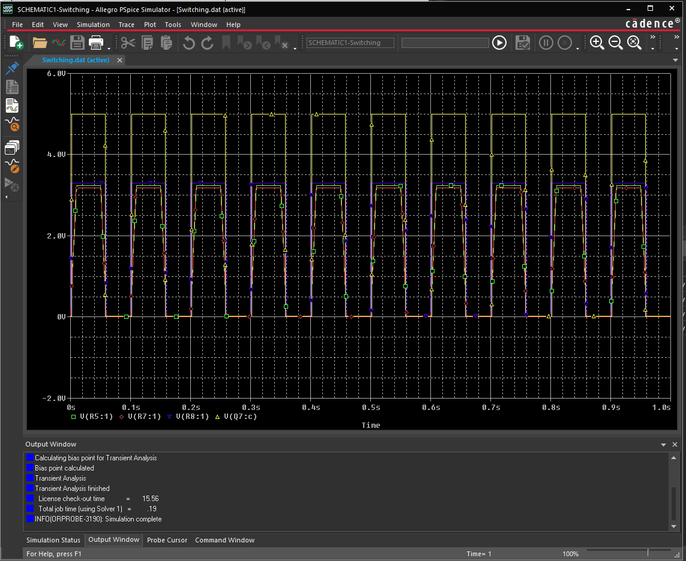

## Introduction: What is a level shifter?

A level shifter either shifts the voltage of a data line up or down depending on what your circuit entails.

## Why?

Integrated circuit powered at different voltage levels often need to be used together within a single PCB.  This can be due to part availability, to ensure compatibility with older chips or systems, or due to specified communication protocols.  In any regard, the specifications of individual chips may make it impossible to use the same _logic_ levels between the two ICs without stepping up or stepping down the voltage level.

The most common type of level shifters are ones that shift 5v logic down to 3.3v logic. If a level shifters are not used, the receiver of the logic will be irreparably damaged. If you do not know if you need this, check your data sheet! Look for a phrase such as "3.3v tolerant", or check the GPIO absolute maximum ratings to see if pins are able to receive voltages higher than the supply voltage.

In the following sections we will discuss a number of options for stepping signal voltages up or down.  The following options will be discussed:

* Voltage dividers (Step down)
* Zener diodes (Step down)
* Transistors
* Level shift ICs

## Voltage divider

The easiest way to shift voltages down is to create a voltage divider, as seen above. This is the easiest and cheapest way to construct a low power level shifter and will be adequate for most projects. A good way to calculate this is use V=IR. 

In the above figure we use the equation V=IR twice.  First, we find the current running through R5 and R6 by taking 5V/(1.8k + 3.3k) = .982mA.  We then use that current to determine the voltage across R6, with .000982*3300=3.23V.

The most important part of selecting the right resistances is to ensure that the current being output from any pin is lower than the rated output current from the transmitting device's datasheet.

## Zener Diode

A Zener diode is a special diode whose reverse breakdown voltage is specially tuned to be used for special cases.  Zener diodes can be purchased with a wide variety of breakdown voltages, including 3.3V.  The circuit above shows the zener diode placed below a resistor, R7, which is used to limit current across the diode.  You will also notice that the diode is placed in "reverse" from what a normal diode would be; this means that whenever a voltage higher than 3.3V (for this particular diode) is present, the diode will enter "reverse breakdown" and permit current to pass through it.  Care must be taken to select a resistance for R7 that does not permit too much current to pass over the diode or from the IC output pin, while permitting enough current to fully activate the diode in breakdown.

## Transistor-based level shifters

BJT transistors can also be used to step up or step down voltages.  While a single NPN transistor can be used to shift logic levels, a single stage will also "invert" the logic signal, making logic-high low and logic-low high.  The solution to this is to use two sequential transistor stages.  This has the effect of inverting the signal twice while changing the voltage level in the process.  Depending on the supply voltage used above the transistors, the voltage output can go up or down.

The issue with all the above solutions, however, becomes apparent when a high number of signals need to be shifted.  The above solutions require a number of parts per signal line, which can increase the complexity of the schematic and system, as well as raise the cost.  This is apparent in the case of bi-directional UART communication, where one seral line must be shifted up and the other line down.

## Level sifting ICs

A number of level-shifting IC's are available, which help address the problems stated above.  For a level shifting IC you need to look at the data sheet to make sure it is acceptable for your usage. Make sure it can handle both voltages before you commit to it. A good example is the LSF0102-Q1. This was chosen as one of its primary bidirectional functions is 3v-5v which is extremely common. 

[Data Sheet](https://www.ti.com/lit/ds/symlink/lsf0102-q1.pdf?HQS=dis-dk-null-digikeymode-dsf-pf-null-wwe&ts=1618807473804)

This specific IC has 2 level shifting channels. You may want more, so check your project before purchase. It is recommended to find an IC with a typical application section as the usage of the pins of some ICs are not immediately clear. This specific IC needs its EN pulled to GND to enable the input, and since all data pins are inputs, it essentially turns off the chip. You then have your A and B lanes, do not mix them up. A1 and A2 are both inputs and outputs on the same line. This is where you put your data lines. Then to change how the IC shifts the voltage you will need to calculate the voltages that need to be on the vref pins for that specific ic. A good way to get those voltages is using the voltage divider seen in Figure 1.

## Comparison

A number of these solutions have been compared in Cadence's PSPICE module.  As you can see, they all produce comparable results.

## External Resources

* <https://itp.nyu.edu/physcomp/lessons/electronics/level-shifting/>

