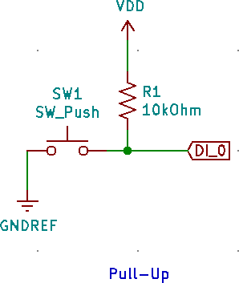
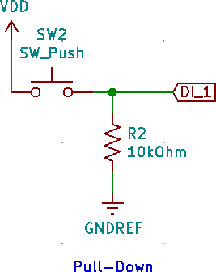

## What are pullup resistors?

These are resistors used to pull a volage on a specific pin high. A good resistor value for pull up resistors is 10kOhm.

**Why would you want this?**

There are many reasons to pull a pin high, the most common is to pull the reset of a microcontroller high to enable its function. The reason you would use a pull up resistor here and not just directly connect it Vin is that a pull up resistor allows the use of a switch to pull the pin to GND. Without this resistor, you would essentially create a short circuit which will most likely burn a trace on your board. An example of a pullup resistor used to pull a microcontroller rest pin high is shown below in Figure 1.

## What are Pulldown Resistors?

These are resistors that pull the voltage on a pin to GND. A good resistor value for pull down resistors is 10k ohms.

### Why would you want this?

This is very good for switches as it puts the switch in a defined OFF state. microcontroller read either an on or off state, the problem is sometimes that on state can be triggered with a few millivolts. As there is interference everywhere this can be a problem. When the pin is not connected to any source high or low, it is considered floating. With a pull-down resistor, it set the pin into a definitive OFF state. The example below in Figure 2 shows a pulldown resistor being used to pull the switch to GND when the switch is not pressed.

## Special Cases: I2C

A Special use case of a Pullup resistor is in the data line of the I2C protocol. This protocol needs the data lines to be pulled high, for most use cases, a 10k resistor will work, but for higher clock speeds you will need to calculate the perfect resistor value by looking at the datasheet for your part.

Refer to TI's [I2C Resistor Sizing guide](https://e2e.ti.com/cfs-file/__key/communityserver-discussions-components-files/6/I2C-Bus-Pullup-Resistor-Calculation.pdf) for more details, or the following online calculators:

* <https://atman-iot.com/blog/i2c-pull-up-calculator/>

