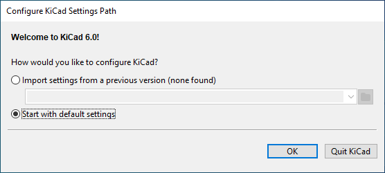

## Resources

* [KiCad.org](https://www.kicad.org/)
* [KiCad Documentation](https://docs.kicad.org/)

## Installation 

Full instructions can be found on the [Fall 2022 Sofware](/fall-2022-software/) page.

## Setup

Select the default setup option when you first load KiCad

