## Introduction

## Resources

* LM3178 ([On Digikey](https://www.digikey.com/en/products/detail/stmicroelectronics/LM317BT/5308099) | [datasheet](https://www.st.com/content/ccc/resource/technical/document/datasheet/group1/a0/db/e6/9b/6f/9c/45/7b/CD00000455/files/CD00000455.pdf/jcr:content/translations/en.CD00000455.pdf))
* [KiCad.org](https://www.kicad.org/)
* [KiCad Documentation](https://docs.kicad.org/)
* [Common Pin Types and their Meanings](/kicad-common-pin-types)

## Steps

1. Open up KiCad (start --> KiCad) and select the Symbol Editor

    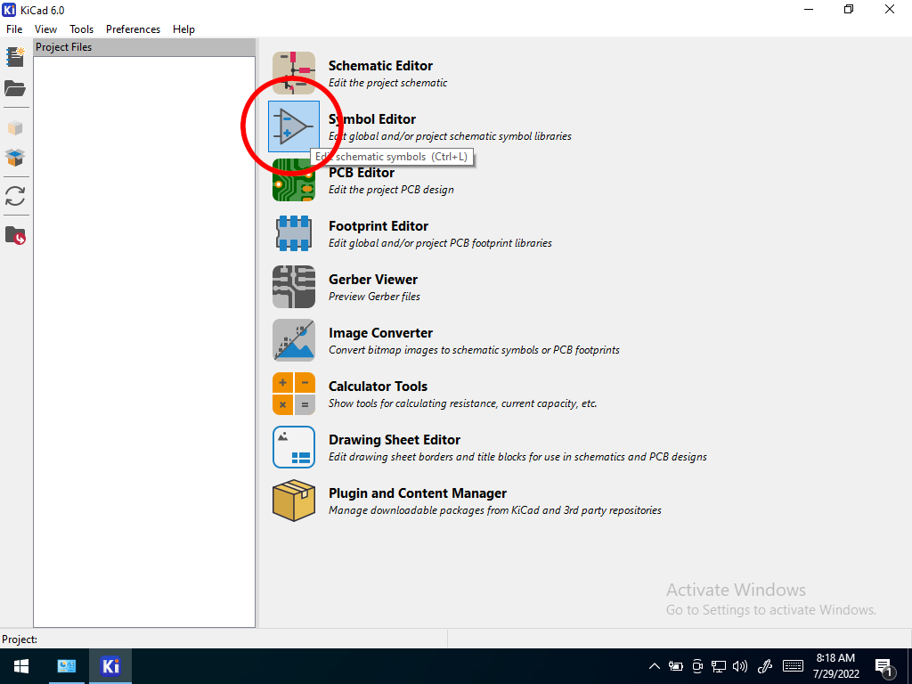

1. If this is the first time running the symbol editor, you will be asked to configure the global symbol library table.  Select the default option.

    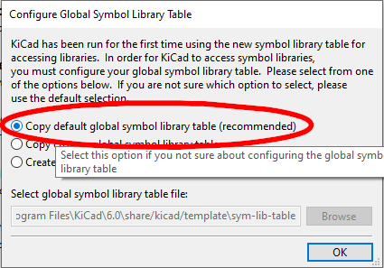

1. Select File-->New Library

    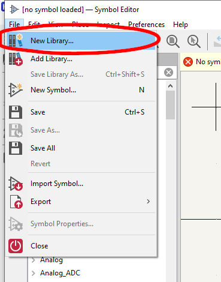

1. Give the library a name unique to yourself

    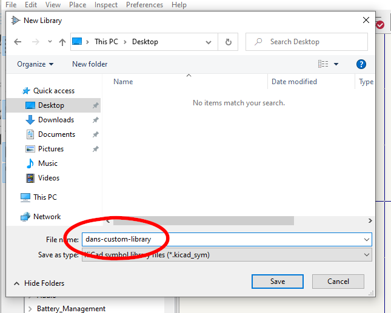
    
1. In the main editor, create a new symbol

    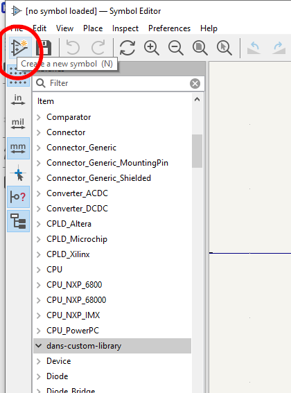

1. Fill in Symbol information

    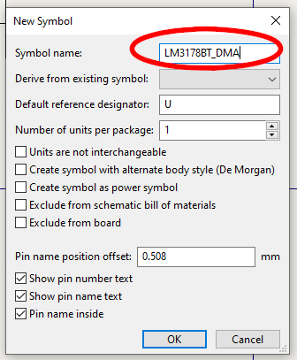

1. Create a rectangle
    
    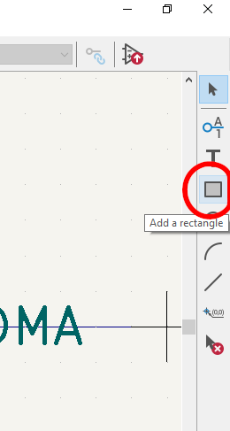
    
1. Place the rectangle in the working area.  It doesn't have to be precise yet.

    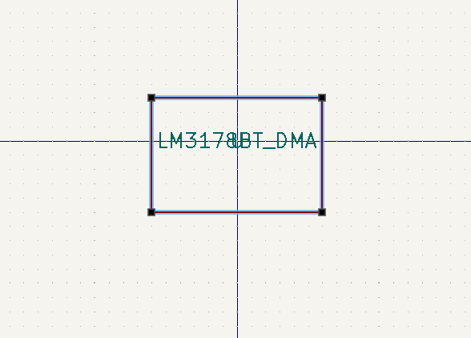

1. Create a Pin to go along the bottom of the part (similar to its package)

    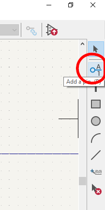

1. Fill in Pin information, including pin name, number, type, and orientation.  Refer to the datasheet.

  
    1. For example, pin one should be an "input" pin
    
        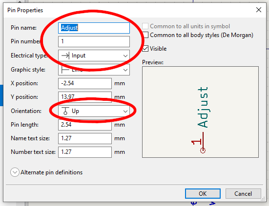
    
    1. Pin 2 is a voltage out pin type
    
        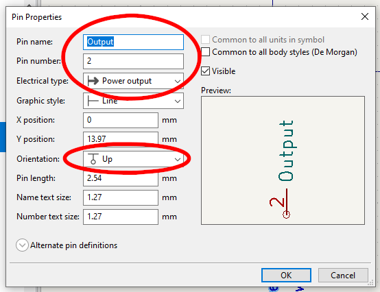
    
    1. Pin 3 is a voltage input type
    
        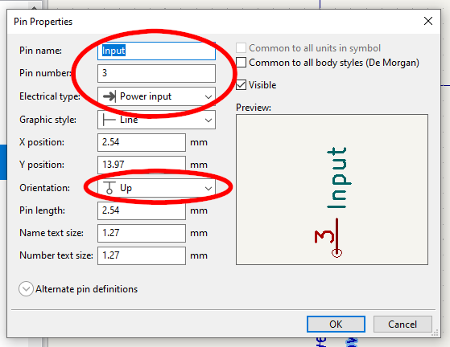

1. Finally, adjust pins and boxes to get the final look and feel of the device.  Select the parts you wish to move, right click and select "move" (or type "m") 

    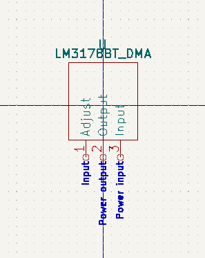
    
1. Save and Close.

