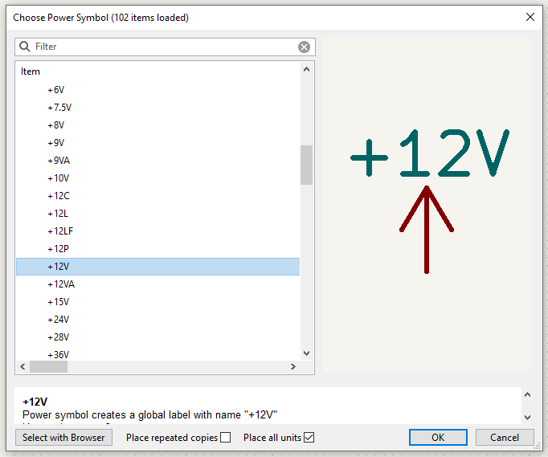
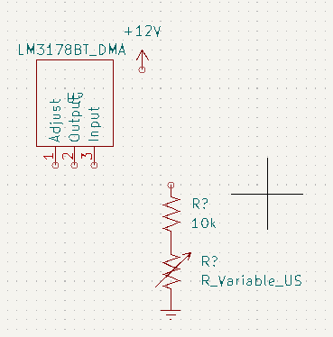
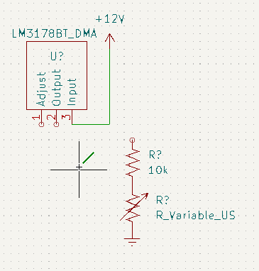

## Introduction

## Resources

* LM3178 ([On Digikey](https://www.digikey.com/en/products/detail/stmicroelectronics/LM317BT/5308099) | [datasheet](https://www.st.com/content/ccc/resource/technical/document/datasheet/group1/a0/db/e6/9b/6f/9c/45/7b/CD00000455/files/CD00000455.pdf/jcr:content/translations/en.CD00000455.pdf))
* Symbol Creation Tutorial
* [KiCad.org](https://www.kicad.org/)
* [KiCad Documentation](https://docs.kicad.org/)

## Steps

1. Open KiCad
1. Create a new project (File-->New Project)

    

1. Give the project a unique name with date or version number

    

1. Select the schematic and double click it to open

    

1. Add a Part

    

1. If this is the first time running the symbol editor, you will be asked to configure the global symbol library table.  Select the default option.

    

1. Select the library and part you created in the "Symbol Creation" tutorial.
1. You can move the symbol around the screen.  Left click to place it
1. Open the datasheet for reference.  What is the acceptable range of input voltage?
1. Add a power port for 12V.  Select "Add power port" from the right side tools
    1. Search or browse for "12V". Select it, select okay.
        
        

    1. Drag the symbol around

1. Repeat the last step, this time adding "GND"
  
   

1. Look at the "basic" example in the datasheet (Figure 6).  You will need to add resistor(s).
1. Add a part and search for "resistor us".  Select the "R_US" part that comes up

    _KiCad's default resistor follows a different standard than the US standard resistor.  Whenever possible select the "_US" version of parts._

    
    
1. Select the R_US text in the part that you place.  Replace the text with the value of the resistor in Ohms.  You can use "10k" or "10kOhm" to denote kilo-Ohms, just be consistent.

    
    
    
    
    

1. Repeat the last two steps, this time adding "Resistor_Variable_US".  Select the "R_Variable_US" part that comes up and replace the text with the value of the resistor in Ohms.  You can use "10k" or "10kOhm" to denote kilo-Ohms, just be consistent.

    

    

    

1. Arrange your parts on the page using the move command.   
    1. Placing your cursor over a part, you can simply type "M" on your keyboard, or right click and select "Move"
    1. Move your cursor to where you'd like to place the part and left click to accept.
    1. Repeat as needed.

1. Wire your parts together
    1. placing your cursor over one of the circular "ports" by each symbol, type "W"
        
        _or_ you can also select the wire tool from the right side of the page
        
        _or_ you can left click any unwired port to activate the wire tool.

    
    
    
    
    
    
        
1. Number your parts
    
    _Reference designators are the text fields by each symbol that uniquely identify the individual part on the schematic (Initially they may say R?, U?, etc).  Each part must have a unique reference designator.  If you are aiming to maintain consistency with an existing schematic, attempting to use the same reference designators as a reference circuit diagram, etc, it may make sense for you to manually number your parts._
    
    1. To manually number your parts, simply click the desired reference designator and assign it a unique ID, typically a capital letter followed by a number
        * resistors typically look like "R1", "R2", etc.
        * capacitors typically look like "C1", "C2", etc.
        * other devicds often look like "U1", "U2", etc.
        * ...for more information search for reference designator conventions in the KiCad documentation or on Google.

    1. To automatically number your parts, go to Tools --> annotate schematic in the menu

        

        1. when the window opens, it will give you a number of options.  
            * You can choose whether to number top-to-bottom first or left-to-right first.
            * You can also choose whether to keep existing annotations (reference designators) and only assign unassigned parts, or to renumber everything.
            * You can also choose to annotate a selection, a current sheet, or the entire project
            * ...there are other options that you can read more about in KiCad's documentation.

            

        1. Accept the options you have selected, and you should see that the chosen parts now have a unique reference designator assigned to them.

            

            

1. Save your schematic.
     