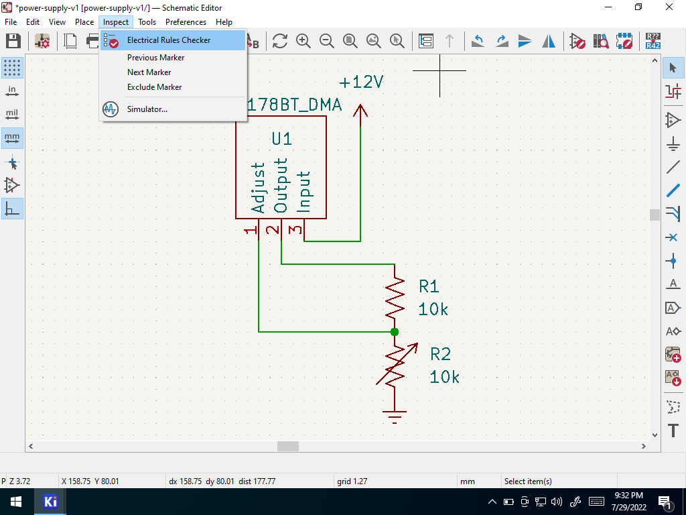

## Introduction

In the last tutorial you created a schematic.  But is it any good?  The electrical rules check, or ERC, is a useful way to debug your circuit.  This example tutorial takes you through the process of finding and eliminating circuit design errors.

## Resources

## Steps

1. Open up the adjustable voltage regulator circuit from the previous tutorial.

    
    
1. Go to inspect --> "electrical rules checker" in the menu.

    

1. Select run and inspect the results.  There should be two errors.

    
    
    _These errors indicate that the 12V and ground power connections are not connected to a source.  Which is true! We forgot to add an external power connector to the board design, as in power from the wall or from an off-board battery!_

1. These errors can be resolved by adding a power connector.  Select add part

    

1.  Search for "screw terminal" and select the 1x2 version (one row, two positions).
    
    
    
1. Place the screw terminal and wire it up

    

    

1. Because the 12v and ground symbols are "power ports", you can use as many of them as you want in your schematic, because they all signify the same thing, rather than a copy.  So for the purposes of ERC, place a separate ground symbol (the same symbol as you used before) near the second pin of the screw terminal and wire it up.
    
    

    
    

1. Run ERC again
   
    

    

    
    
    _Why are there still errors?  The screw terminal pins are "passive" pins; they don't indicate a power connection.  To solve this you must explicitly state that pins 1 and 2 of the screw terminal are power outputs._
      
1. Double click on the screw terminal

    
    
    1. Click Edit Symbol
    
        _Editing a symbol of a built-in library directly from within a schematic will only impact **that schematic**; it will not be propagated back to the library._
        
    1. Change pin 1 and 2 to "power output" types
    
        
        
    1. Save and close the symbol editor window.
    
        

1. Re-run ERC one last time

    
    
    _The one remaining warning indicates that you have locally edited a symbol within the schematic.  This was intentional in our case, and can be ignored._