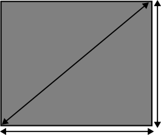

1. Take a look at the datasheet for the TO-220 package the regulator comes in.  variable "b" indicates pin width, with a minimum width of .61mm and a maximum width of .88mm.  The maximum thickness of the pin is .70mm Let's make sure our hole is big enough.

    

    _if the maximum width $w$ is .88mm and the maximum thickness $t$ is .70mm, then the maximum possible hypotenuse $h$ is $h=\sqrt{w^2+t^2}$, or 1.12mm.  Setting the drill size to that maximum possible value will ensure **all** parts fit, though there may be some slop in standard parts._
    
1. Enter the rest of the values that matter.  In the case of this package, we care about the pin pitch (2.4mm) and the pad width and height.

    _Pads that are too large will get too close to their neighbor and risk a short, especially during soldering.  Pads that are too small may not be manufacturable with some processes, and are more likely to be stripped off during soldering.  Try to split the difference between these two extremes.  The DFM check (upcoming tutorial) will also help you understand your limits._
    
1. Create a new footprint library for your _project_.

    _It's probably a good idea at this early stage in your PCB design career to associate your footprint library with your project.  You may make different decisions later._
    
1. Save the footprint in the new footprint library