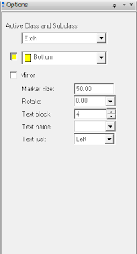

---
tags:
- cadence
- pcb
title: Adding Text to a Layout in Cadence PCB Editor
---

## Introduction

Text is important on PCB layouts to identify the designers, project, version, components, etc. Typically, text can be placed on a silkscreen layer that sits on top of the copper. However, our manufacturing process in PRLTA 109 only supports text that is milled on the TOP COPPER or BOTTOM COPPER layers.

**Note:** It is required that all PCB designs have your name, course, and team number so that the Peralta Engineering Studios staff can distinguish your board from others.

## How do you create millable text in Cadence PCB Editor?

1.  Open your design in PCB Editor

2.  Choose Setup > Design Parameters... and click the Text tab. Click the ... button next to Setup text sizes (see Figure 1). The Text Setup window will open (see Figure 2).

  ------------------------------------------------------------------------------
   [{class="img-fluid"}](larger/image0000.png)
                    Figure 1: Design Parameter Editor Text tab
  ------------------------------------------------------------------------------

  ------------------------------------------------------------------------------
   [{class="img-fluid"}](larger/image0001.png)
                           Figure 2: Text Setup window
  ------------------------------------------------------------------------------

2.  In the Text Setup window, change the Photo Width for Text Blk 4 to 10.00 (see Figure 2). The 4th text value is big enough to read but not overly large. Click OK and OK to return to your design.

3.  Click the abc+ button in the toolbar (see Figure 3) and click on the Options tab on the right hand of the screen (see Figure 4).

  ----------------------------------------------------
   [{class="img-fluid"}](larger/image0002.png)
               Figure 3: Add Text button
  ----------------------------------------------------

  ------------------------------------------------------------------------------
   [{class="img-fluid"}](larger/image0003.png)
             Figure 4: Options tab configured for the 4th text block
  ------------------------------------------------------------------------------

4.  Configure the options to make sure the Top or Bottom layer is selected, and that the Text block is set to 4 (or whichever one that you changed in step 2) (see Figure 4).

5.  Click anywhere on the board and type the text that you wish to add (see example, Figure 5).

  ------------------------------------------------------------------------------
   [{class="img-fluid"}](larger/image0004.png)
                        Figure 5: Example text on a layout
  ------------------------------------------------------------------------------

*Based on a tutorial by Robert Goby*
