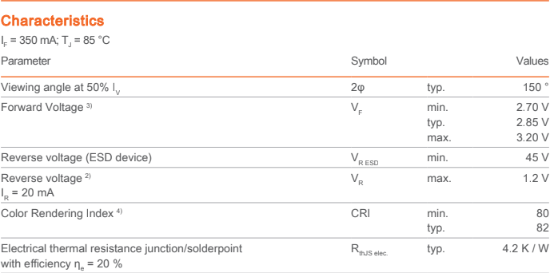
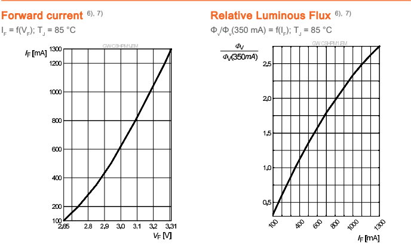

When calculating the resistance value for your current limiting resistor there are a few variables to consider. First, what is the supply voltage that will be applied to the LED? Second, what is the forward voltage of the LED you chose? Third, what is the amount of current you want to flow through your LED? By answering these questions, you will be able to calculate the value for the resistor. To begin the process, you must know what supply voltage you will be giving the LED. Whether its 12V, 5V, or 3.3V this value is important to the calculation of the resistance. The next piece of information that is needed is the forward voltage for the particular LED that is being used. To find this information you must reference the datasheet for the part. The forward voltage can be found in the Electrical Characteristics section of the datasheet. Shown below is an image of the forward voltage for an Osram LED: 

As we can see from the image, the maximum forward voltage for the LED is 3.2V. The next piece of information that is needed is the current that needs to flow through the LED. To find this information, the datasheet must once again be referenced. Typically, this information is shown in the form of a graph depicting forward current vs. luminous intensity. Shown below is an example of a pair of graphs from the same Osram LED as the before:

These graphs show useful information that is needed to calculate our resistor value. The graph on the right shows the relative luminous flux vs. forward current. The first step is to choose the brightness you want for your application. For this example, we will use 1.0 for our value. From the graph, we can gather that at 1.0 relative intensity, a 350mA forward current is needed. Now the information from the graph on the left must be referenced. From the graph, we can see that for a forward current of 350mA, the LED will have a forward voltage of 2.8V. After finding that, we have all the information that is needed to calculate the value for the current limiting resistor. The equation is shown below:

$$R_$$

Where $R_$ is the forward current in Amps. For the example that was chosen, the equation would look like this:

$$R_$$

From this equation, we can calculate the resistance as 6.28Ω (assuming a supply voltage of 5V). While most LEDs will not require this amount of current in order to operate (most datasheets say 20mA) it is still able to show how to find and use the information in the datasheet to find the current limiting resistor value.
