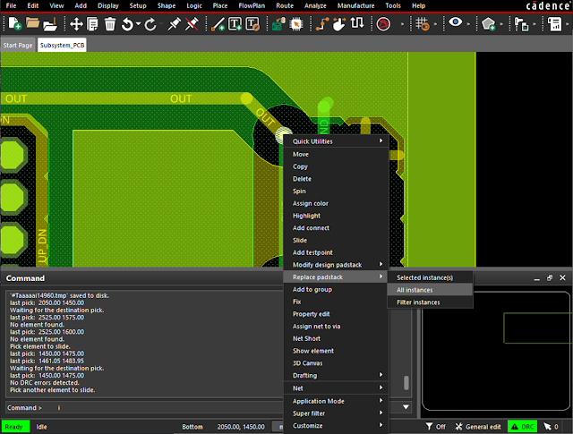
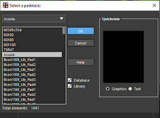
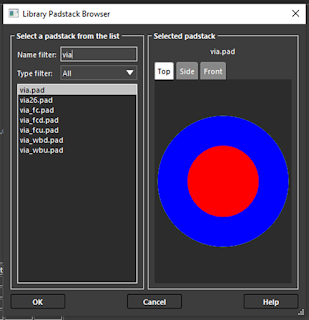
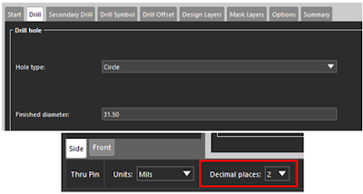
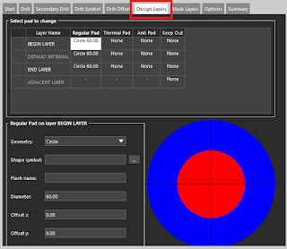
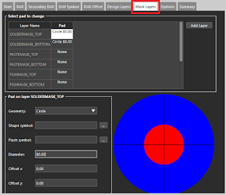

---
tags:
- asu
- cadence
- pcb
title: Changing the Default Via Padstack in Cadence PCB Editor
---

## Introduction

A via is an electrical interconnection that connects one layer of a PCB to another layer of a PCB. Vias are typically used when two wires need to cross on the same side of a PCB design, but cannot without continuing the trace on a different layer. It is best to minimize the use of vias for boards being manufactured in Peralta to maximize reliability, but sometimes they are necessary in order to complete a design. If you do need a via, the default via padstack in Cadence is too small for the [LPKF ProtoMat S63 PCB Mill](http://www.lpkf.com/products/rapid-pcb-prototyping/circuit-board-plotter/protomat-s63.htm) that we use to manufacture PCBs in PRLTA 109. There are two ways to address this issue:

1.  Place all of your vias, and then replace them with the provided asuvia.pad padstack (provided in the Cadence installation instructions you followed earlier in the semester).
2.  Change the size of the drill and pad on the Cadence default via.pad padstack.

## 1.0: Replacing your existing vias with the asuvia.pad padstack

1.1. In Windows, lay out the traces and vias on your board, minimizing the number of vias used.

1.2. Right-click on one of the vias and select Replace Padstack > All instances (see Figure 1 below)

[{class="img-fluid"}](larger/image0044.png)

Figure 1: Using "Replace Padstack" to change all instances of a via padstack

1.3. Select the asuvia.pad Padstack from the list of available padstacks (see Figure 2 below) and click OK. **Note: This will only work if you have configured Cadence properly according to our provided instructions, and your Cadence/symbols folder contains asuvia.pad**

** **

[{class="img-fluid"}{width="320"}](larger/image0045.png)

Figure 2: Selecting the asuvia padstack

## 2.0: Changing the default via.pad padstack

As an alternative to using asuvia.pad, you can instead change the default via.pad padstack. You do not need to do both.

2.1. In Windows, open Padstack Editor

2.2. Choose File > Padstack Library Browser... and choose via.pad from the list (see Figure 3). Click OK.

[{class="img-fluid"}{height="320"}](larger/image0046.png)

Figure 3: Choosing via.pad from the Library Padstack Browser

2.3. In the Drill/Slot hole section, set the Drill diameter to 31.5 and change your "Decimal places:" to 2 (see Figure 4).

[{class="img-fluid"}](larger/image0047.png)

Figure 4: Drill diameter set to 31.50

2.4. Click the Design Layers tab (see Figure 5) and change the settings for the BEGIN LAYER, DEFAULT INTERNAL, and END LAYER. Click the Mask Layers tab (see Figure 6) and change the settings for SOLDERMASK_TOP and SOLDERMASK_BOTTOM.

[{class="img-fluid"}{width="320"}](larger/image0048.png)

Figure 5: Design Layers tab with layers configured

[{class="img-fluid"}{width="320"}](larger/image0049.png)

Figure 6: Mask Layers tab with layers configured

2.5. Choose File > Save and overwrite the existing file. You have now successfully changed the default via size to be manufacturable and handle up to 5 amps of current!

*Note:* If you are working on the computers in Peralta Studios, you may not be able to change and save the default via because of file permissions. Instead, simply change the padstacks to use the asuvia.pad after you are done designing the board.

The following video shows the process described in this tutorial from start to finish in Cadence 16.6 (old version):

*Based on a video and tutorial created by Robert Goby and updated by Qinchen Zha (2/2020) and Ryan Sparks (10/2020).*
