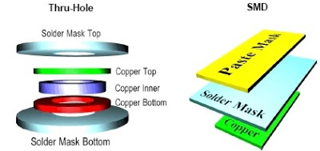
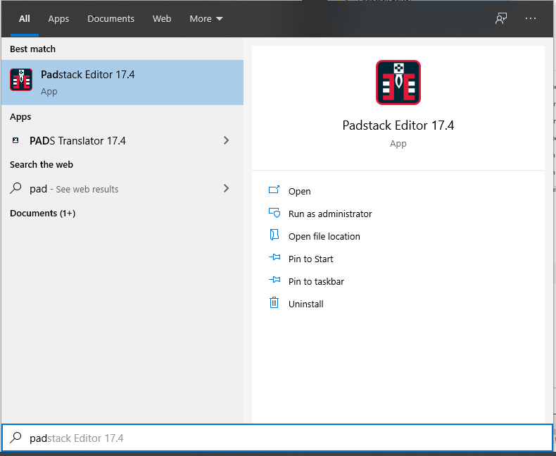
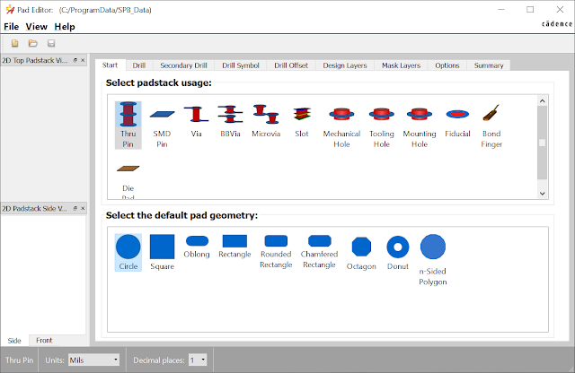
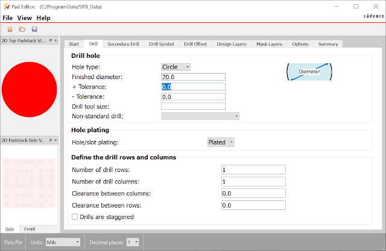
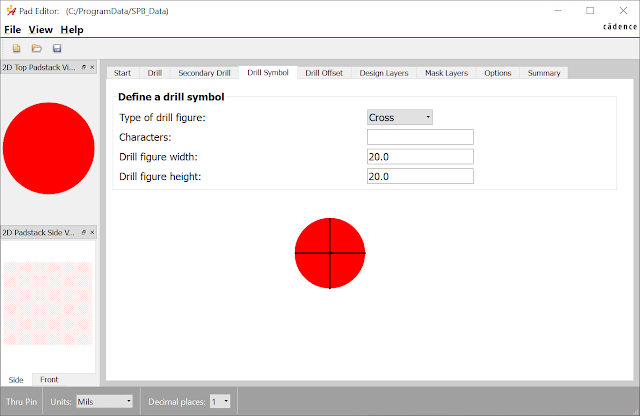
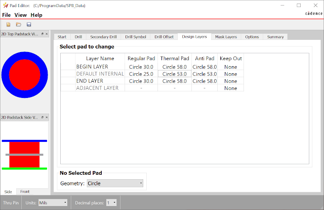
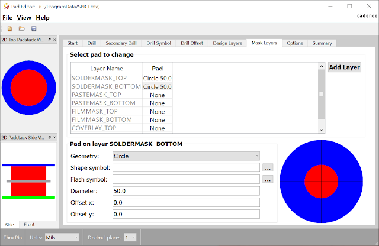
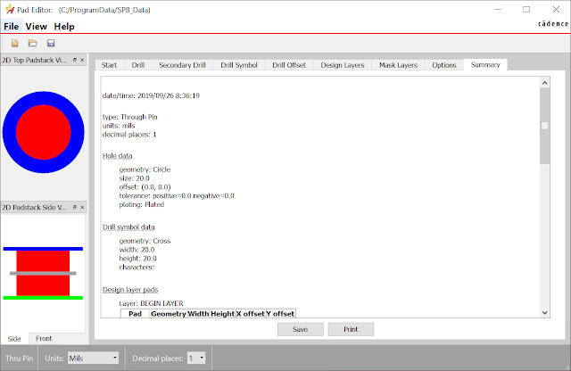

---
tags:
- cadence
- pcb
title: Creating a custom padstack in Cadence
---

## Introduction

A [padstack](https://www.speedingedge.com/PDF-Files/anatomy%20of%20a%20plated%20hole.pdf) is a design for the exposed copper surface area for each hole or pad on the board where the component is mounted and soldered (see example, Figure 1). You may need to create a custom padstack when creating custom parts to ensure that the pad and hole are big enough to be reliable. This tutorial describes the manual creation of custom padstacks using the Pad Designer application.

  ------------------------------------------------------------------------------
   [{class="img-fluid"}](larger/image0083.jpg)
      Figure 1: Padstack examples for through-hole and surface mount devies
  ------------------------------------------------------------------------------

The example below is for a simple round pad.  You should look up the dimensions for your own parts.

## 1. Search the Datasheet for the Footprint Specifications

In order to build a custom padstack, you first need to find the footprint (sometimes called "land pattern" specifications in the datasheet for the component. 

## 2. Create a Custom Electrical Padstack

1.    Open the new Padstack editor in Cadence:

[{class="img-fluid"}](figures/PadstackEditorSearch.png)

2.    Select Thru-pin and circle on the start tab

[{class="img-fluid"}](larger/image0085.png)

3.    Enter the drill diameter

[{class="img-fluid"}](larger/image0086.png)

4.    Define the symbol that will be used to represent the drill hole:

[{class="img-fluid"}](larger/image0087.png)

5.    Define the Top and bottom layer inner, outer, and thermal geometry.  Since Peralta uses two-layer boards, geometry other than begin and end layers will be ignored.

[{class="img-fluid"}](larger/image0088.png)

The layers tab provides options for editing individual layers or the entire PCB. You can click on layers and make changes via the Regular Pad, Thermal Relief, and Anti Pad boxes described below.

The default layers for a padstack are:

-   BEGIN LAYER - top copper layer of the PCB
-   DEFAULT INTERNAL - inner layers of the PCB (our PCB mill is limited to 2 layers)
-   END LAYER - bottom copper layer of the PCB
-   SOLDERMASK_TOP - top colored soldermask layer of the PCB
-   SOLDERMASK_BOTTOM - bottom colored soldermask layer of the PCB
-   PASTEMASK_TOP - top solder paste layer of the PCB (uncommon in class)
-   PASTEMASK_BOTTOM - bottom solder paste layer of the PCB (uncommon in class)
-   FILMMASK_TOP - top conformal coating layer of the PCB (uncommon in class)
-   FILMMASK_BOTTOM - bottom conformal coating layer of the PCB (uncommon in class)

6.    Define the soldermask geometry for the top and bottom layers

[{class="img-fluid"}](larger/image0089.png)

7.    Look through the summary page to ensure everything was entered correctly:

[{class="img-fluid"}](larger/image0090.png)

8.    Save to the custom symbols folder you created and included in your padpath.

## Additional Resources

-   [Part 19: Designing Pads video](https://www.youtube.com/watch?v=SMYi7eS94J8) from iEngineered
