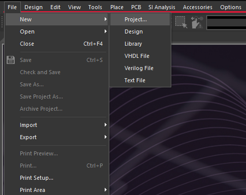
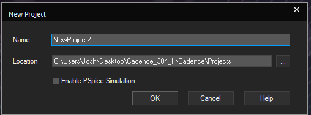
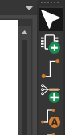
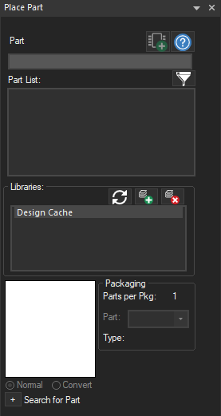
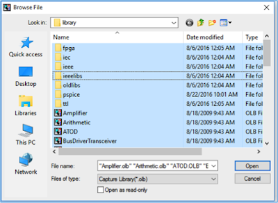

**Creating a new project in Cadence**

1.  In Windows, open the Design Entry CIS program. This program allows you to edit schematics, and will be used to export a netlist describing your schematic into the PCB Editor.

2.  Choose "New > Project..." (see Figure 1), type a name for the project and choose a place to save your project files. Since we will not be simulating the circuit in this tutorial, leave "Enable PSpice Simulation" unselected and click OK (see Figure 2). 

*WARNING: Do not use spaces or non-alphanumeric characters in the file name for your project.*

  {class="img-fluid"}
  -----------------------------------------------------------------------------------------------------------------------------
  Figure 1: New Project menu

  {class="img-fluid"}
  ----------------------------------------------------------------------------------------------------------------------------
  Figure 2: Making a New Project

-- --

3.  You may need to add an existing library in order to use Cadence's built-in schematic symbols or custom parts you have previously created. While the option to add libraries directly from the New Part dialog no longer exists in Cadence 17.4, adding a library can be done immediately after the new project has been created:

First, click on the Add Part button (which looks like an integrated circuit with a green plus sign) on the toolbar (see Figure 3)

  {class="img-fluid"}
  ------------------------------------------------------------------------------------------------------------------------------
  Figure 3: Toolbar with Add Part button

Second, click the Add Library button (which looks like a stack of books with a green plus sign on the bottom right hand corner) in the Place Part dialog box (see Figure 4)

  {class="img-fluid"}
  ------------------------------------------------------------------------------------------------------------------------------
  Figure 4: Place Part dialog box

Finally, select all of the files in the library folder and click Open (see Figure 5)

  {class="img-fluid"}
  -----------------------------------------------------------------------------------------------------------------------------
  Figure 5: Browse File dialog box to add libraries

The default location where library files are stored should be similar to: C:/Cadence/SPB_17.4-silent/tools/capture/library/

4.  If you plan to use any schematic symbols not built into Cadence, it is a good idea to create a custom library in which to store the symbols. Further instructions are available on the [*Creating a Custom Library in Cadence page*](creating-a-custom-library-in-cadence.html).
