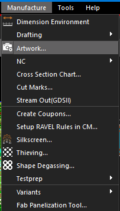
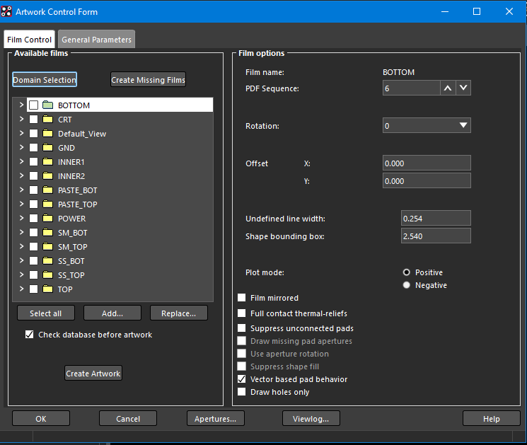
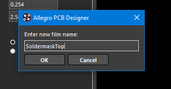
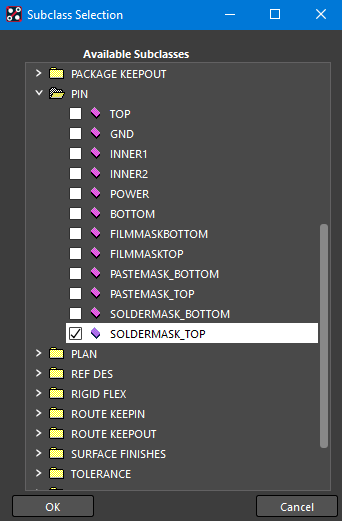
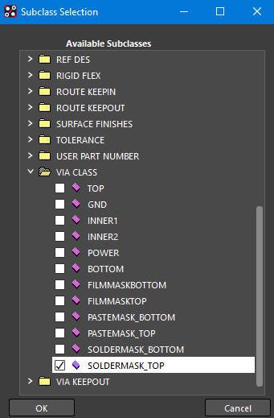
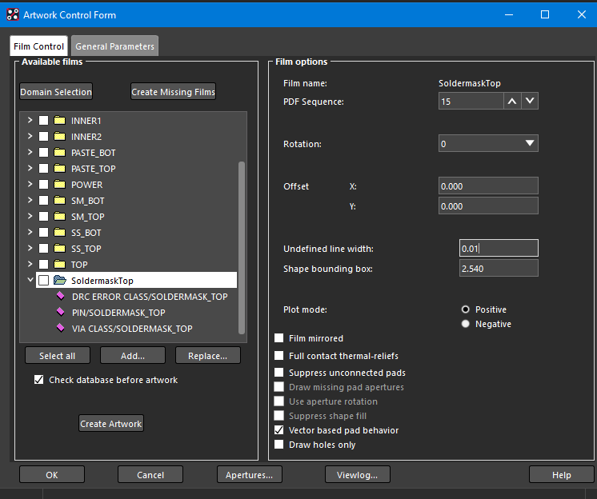
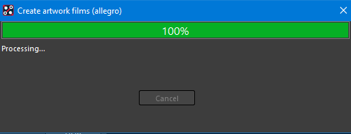

---
tags:
- cadence
- pcb
title: Exporting Solder Mask Layers from Cadence PCB Editor
---

## What is a solder mask?

[Solder mask](https://en.wikipedia.org/wiki/Solder_mask) is the thin polymer layer that is applied to a printed circuit board to insulate copper traces from unwanted connections. It is often green, red, or blue, and is put over all parts of a PCB except where components are to be soldered.

## How do you create a solder mask layer in PCB Editor?

1.  Export TOP, BOTTOM, and OUTLINE Gerber files for your design (see [Exporting Gerber Files from Cadence](exporting-gerber-files-from-cadence-pcb-editor.html)).

2.  In PCB Editor, open your completed design and choose Manufacture > Artwork... (see Figure 1). The "Artwork Control Form" will open (see Figure 2).

  -------------------------------------------------------------------------------------------------------
   [{class="img-fluid"}](solder_mask_figures/figure-01.png)
                              Figure 1: Manufacture > Artwork... menu option
  -------------------------------------------------------------------------------------------------------

  -------------------------------------------------------------------------------------------------------
   [{class="img-fluid"}](solder_mask_figures/figure-02.png)
                                      Figure 2: Artwork Control Form
  -------------------------------------------------------------------------------------------------------

3.  Right-click on any of the folders in the "Available films" section and select "Add Manual" (see Figure 3). The film naming dialog box will appear (see Figure 4).

  -------------------------------------------------------------------------------------------------------
   [{class="img-fluid"}](solder_mask_figures/figure-03.png)
                                Figure 3: Add Manual contextual menu option
  -------------------------------------------------------------------------------------------------------

4.  In the film naming dialog box, name the new film name SoldermaskTop (or something similar, see Figure 4) and click OK. The "Subclass Selection" dialog box will appear (see Figures 5, 6, and 7).

  -------------------------------------------------------------------------------------------------------
   [{class="img-fluid"}](solder_mask_figures/figure-04.png)
                                     Figure 4: Film naming dialog box
  -------------------------------------------------------------------------------------------------------

5.  In the "Subclass Selection" dialog box, expand the DRC ERROR CLASS, PIN, and VIA CLASS folders and check the box next to SOLDERMASK_TOP in each folder (See Figures 5, 6, and 7). Click OK.

  -------------------------------------------------------------------------------------------------------
   [{class="img-fluid"}](solder_mask_figures/figure-05.png)
                                         Figure 5: DRC ERROR CLASS
  -------------------------------------------------------------------------------------------------------

  -------------------------------------------------------------------------------------------------------
   [{class="img-fluid"}](solder_mask_figures/figure-06.png)
                                               Figure 6: PIN
  -------------------------------------------------------------------------------------------------------

  -------------------------------------------------------------------------------------------------------
   [{class="img-fluid"}](solder_mask_figures/figure-07.png)
                                            Figure 7: VIA CLASS
  -------------------------------------------------------------------------------------------------------

6.  In "Artwork Control Form", ensure that "Film name" is SoldermaskTop and "Undefined line width" is 0.01 (see Figure 8).

  -------------------------------------------------------------------------------------------------------
   [{class="img-fluid"}](solder_mask_figures/figure-08.png)
                           Figure 8: Film name and undefined line width options
  -------------------------------------------------------------------------------------------------------

7.  Repeat steps 3 - 6 to create a solder mask for the bottom layer, if desired.

8.  Under "Available films", select both the SoldermaskTop and SoldermaskBottom and click "Create Artwork".

9.  If successful, you will see the message in Figure 9.

  -------------------------------------------------------------------------------------------------------
   [{class="img-fluid"}](solder_mask_figures/figure-09.png)
                                            Figure 9: Success!
  -------------------------------------------------------------------------------------------------------

*Based on a tutorial by Seana O'Reilly*
