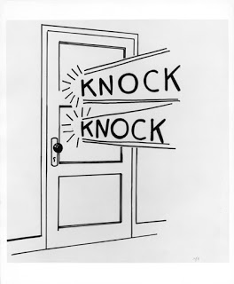
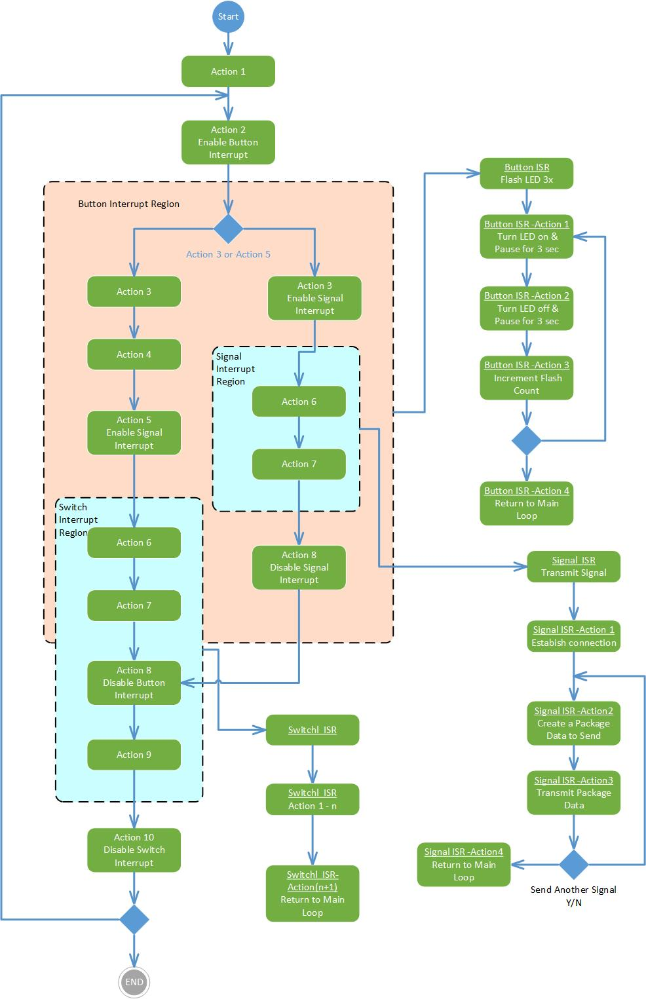

---
tags:
- microcontroller
- software
title: Interrupts
---

## What is an interrupt?

Consider the following knock-knock joke:

[{class="img-fluid"}](larger/image0171.jpg)

**Joker:** "Knock, knock"

**Innocent Person:** "Who's there?"

**Joker:** "Interrupting cow"

**Innocent Person:** "Interrupting co..."

**Joker:** "Mooooo" (while the innocent person is responding)

We started this discussion of interrupts with a knock knock joke because it captures the essence of what an interrupt is in an embedded system. Consider the main loop of the program as the "Innocent Person" and the event (e.g., sensor) as the "Joker". The Joker causes the normal routine of the knock knock joke to be broken by the event of the punchline delivery (interrupt).

When an event in a system triggers an interrupt, the program momentarily breaks from whatever it is currently doing in the main loop, executes code in an interrupt service routine, and returns to the place where it left off in the main loop. Since most microcontrollers can only handle one software task at a time, using interrupts allows multiple things to be monitored at the same time.

## What is an interrupt service routine?

An interrupt service routine (abbreviated ISR) is the separate program code that is executed after an interrupt is triggered. It is similar to calling a function (except that the calling mechanism is by interrupt, rather than explicit call in the code).

## What are the different types of interrupts?

-   **Internal interrupt.** Internal interrupts are created internally by the microcontroller. For example, when the UART receives a byte from an external sensor, it could trigger an interrupt.
-   **External interrupt.** External interrupts are created externally to the microcontroller and are usually associated with external interrupt pins. For example, a button could be attached to a microcontroller pin and when the pin changes state, an interrupt could be triggered.

## How does interrupt priority work?

Since interrupts can happen at nearly any time, there is a possibility that interrupts from two or more different sources can be generated at the same time. If the microcontroller finds pending interrupts from multiple different sources, it will use the programmer-assigned priorities for each interrupt source to determine which interrupt service routine to run first. Once the first interrupt is serviced, additional interrupts will be serviced in priority order.

## How do I create a UML diagram for an interrupt service routine?

An example UML activity diagram for an interrupt-based system is shown in Figure 1 below.

[{class="img-fluid"}](larger/image0172.jpg)

For more information on UML, please see the [What is Unified Modeling Languageâ„¢ (UML®)?](software-design.html) blog post.

## What is the general process for enabling interrupts on a microcontroller?

Interrupts are typically active in a specific region of code defined by the programmer. Before the region of code where interrupts should be active, interrupts must be enabled (typically one or more lines of code specific to the microcontroller). After the region of code where interrupts should be active, interrupts must be disabled (typically one or more lines of code specific to the microcontroller).

## References

-   <https://www.techopedia.com/definition/7772/internal-interrupt>
-   <https://www.techopedia.com/definition/7115/external-interrupt>
-   <http://www.scriptoriumdesigns.com/embedded/interrupts.php>

*Based on a blog entry written by Kevin Nichols*
