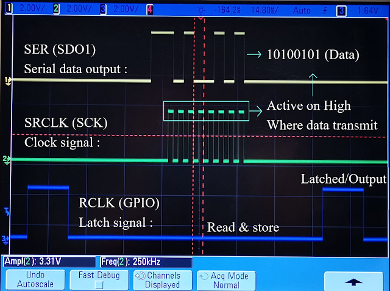
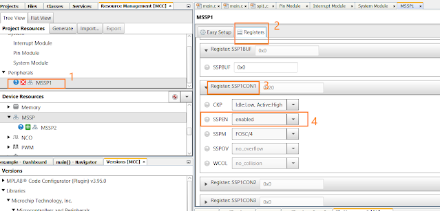
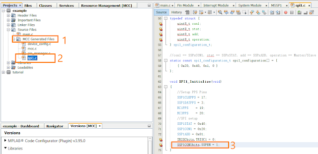
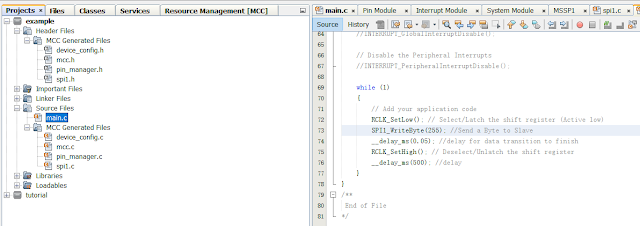

---
tags:
- spi
title: SPI & Shift Register Tutorial
---

**Serial Communication - SPI & Shift Register Tutorial**

# **Objectives** {#objectives style="line-height: normal; margin-bottom: 0in; margin-left: 0in; margin-right: 0in; margin-top: 24.0pt; margin: 24pt 0in 0in;"}

Getting familiar with the SPI serial communication protocol using MCC under the MPLAB X programming environment to program the PIC16F18446 Curiosity Nano development board and control a shift register to drive 8 LEDs on and off. In this tutorial, you will learn to set up the Serial Peripheral Interface (SPI), Shift Registers, and 3 of the major numeral system (decimal, binary, and hexadecimal).

# **Resources** {#resources style="line-height: normal; margin-bottom: 0in; margin-left: 0in; margin-right: 0in; margin-top: 24.0pt; margin: 24pt 0in 0in;"}

[PIC16F18446 Curiosity Nano Hardware User Guide](http://ww1.microchip.com/downloads/en/DeviceDoc/50002808B.pdf)

[SN74HC595 8-Bit Shift Registers Datasheet](http://www.ti.com/lit/ds/scls041i/scls041i.pdf)

[Curiosity Nano & MPLAB Tutorial](https://docs.google.com/document/d/1oiKwOQ0xvt14O_Bh0nONxvTRSYAj-ji6eLNhmsXVwZ4/edit)

[YouTube Tutorial 1](https://youtu.be/s3fj0yE4xLE)

[YouTube Tutorial 2](https://youtu.be/RQEH6XNZmkQ)

# **Create Your First Project**

1.  Open the MPLAB X IDE, you can plug the USB mini cable into the Curiosity USB debugging port. Once you plug the USB to your PC, a green LED will light up. This indicates the Curiosity board has been powered up.

2.  To create a new project, go to "**File**" - "**New Project**" - select "**Standalone Project**" - and click "**Next >**"

3.  Select **Device** as "**PIC16F18446**" and click "**Next >**"

4.  If you have your Curiosity Nano connected to your PC, the serial number of the device will show up.

Select the serial number of your Curiosity board and click **"Next >."**

5.  Now you will have to select a compiler for the MPLAB X. If you haven't installed **Microchip XC8 Compiler**, you can install it by clicking the **"Download Latest."**

6.  Once the XC8 compiler has been installed, select the **"XC8"** as the compiler for this project.

7.  The last step is to give a name to your first project as well as the location where you want to put your project.

8.  Once you create a new project, you can open the MCC Code Configurator by clicking **"Tools" - "Embedded".**

-   For more details about these steps, please refer to the following tutorial: [Curiosity Nano & MPLAB Tutorial](https://docs.google.com/document/d/1oiKwOQ0xvt14O_Bh0nONxvTRSYAj-ji6eLNhmsXVwZ4/edit)

# **2. Serial Communication**

## **2.1 Control 8 LEDs using shift registers with SPI function**

***In this section, you will wire 8 external LEDs to the shift register and connect it to the curiosity nano board.***

*Required Hardware: Curiosity Nano, Breadboard, SN74HC595 Shift Registers, 220 Ohm resistors x8, Green LED x8*

### **2.1.1 Hardware Setup**

1.  From [SN74HC595 8-Bit Shift Registers Datasheet](http://www.ti.com/lit/ds/scls041i/scls041i.pdf), we know that the shift register has 8 outputs from QA to QH.

2.  Place the Curiosity Nano Board and the shift register onto the breadboard**,** which will take 25 rows of space. (Shown in Figure 1)

3.  Use 220 ohms resistors to connect 8 output pins from QA to QH on the shift register to 8 separate rows.

4.  Connect the Anode of the LEDs to each resistor. Connect the Cathode to Ground.

5.  Connect the SER, RCLK, SRCLK pin to 3 GPIO pins on Curiosity Nano Board. Connect OE to ground, and connect SRCLR to power.

-   For the pin assignment, please refer to the following table and Figure 1.

      --------------------- -------------------- --------------------
      Shift Register pins   **Connection**       **Function**
      QA - QH               LED 1 - LED 8 Digi   tal output
      SER                   Nano - SDO1 Seri     al data output
      RCLK                  Nano - digital out   Read & Latch data
      SRCLK                 Nano - SCK           SPI Clock signal
      OE / SRCLR            GND / POWER          Enable / Clear all
      --------------------- -------------------- --------------------

    The Hardware Setup for Lab 2.1 should look like this: {class="img-fluid"}

{class="img-fluid"}

Figure 1: Hardware setup for SPI serial communication

2.1.2 Software Configuration

As an example and an overview of the SPI function using the oscilloscope, each bit from a byte (8 bit) of the serial data is being sent with the clock signal toggling. (Shown in Figure 2) The goal of this SPI serial communication is to transmit a Byte of data and latch those bits into 8 parallel digital output using the 74HC595 shift register.

{class="img-fluid"}

Figure 2: SPI signal displayed on Keysight Oscilloscope

Double click on an MSSP choice to add an MSSP block to the MCC under Device Resource

Under the Pin Manager, you should deselect the SDI input by clicking on the gray lock symbol in the 3rd pin of Port A.

Under the Pin Module, uncheck the analog option for all pins, and give a custom name to a GPIO pin for RCLK.

The Code Configurator setup for Lab 2.1 should look like this:

{class="img-fluid"}

Setting up the SCK, RCLK, and SDO pin

Click on the MSSP1 under project resource, go to the Register tab, change the SSPEN of SSPCON1 to enabled, leave everything else as default settings.

{class="img-fluid"}

2.1.3 MCC (Microchip Code Configurator) Generated Files and Main.c

Click the Generate button under the project resource, and now your projects should have all the MCC generated files.

Go back to Projects, you will see two subfolders called MCC Generated Files under both Header Files and Source Files. These folders contain the generated code, functions, and macros by MCC (Microchip Code Configurator).

Click the spi1.c file, and Change SSPEN to 1 under the SPI1_Initialize to enable the serial communication.

{class="img-fluid"}

After configuring the software, you can go ahead and write your own functions. We can double click the "spi1.h" and see all the macros that MCC generated for us.

Since we are sending 8-bit information to the shift register, go back to the "main.c" and use the macros inside the main function. You can also add a delay function in order to see the on and off transition of the LED.

RCLK_SetLow(); // Select/Latch the shift register (Active low)

SPI1_WriteByte(255); //Send a Byte to Slave

__delay_ms(0.05); //delay for data transition to finish

RCLK_SetHigh(); // Deselect/Unlatch the shift register

__delay_ms(500); //delay

Now your main function should look something like this:

{class="img-fluid"}

Main.c for Lab 2.1

Click the Hammer button ({class="img-fluid"}) to compile the project. If you see "Build Successful", then you can flash the program to the microcontroller by clicking the Run main project button ({class="img-fluid"}.) 2.1.4 Practise exercise using different numeral systems.

In the exercise above, we used the decimal system to represent an 8-bit data, which is more common for humans. Computers, however, only have on and off, called a binary digit (or, bit, for short). A binary number is just a string of zeros and ones: 11011011, which often written after "0b". [1](figures/figure_000.png) For example, 0b10100101 means 10100101 binary.

As computers got bigger, it was more convenient to group bits by four, which can have 16 values (0000 to 1111, or 0 to 15). Hex = 6 and Decimal = 10, so it is called hexadecimal. In computer jargon, four bits make a nibble (sometimes spelled nybble). A nibble is one hexadecimal digit, written using a symbol 0-9 or A-F. Two nibbles make a [byte](https://draft.blogger.com/#) (8 bits). Most computer operations use the byte, or a multiple of the byte (16 bits, 24, 32, 64, etc.). Hexadecimal makes it easier to write these large binary numbers. [1](figures/figure_000.png)

To avoid confusion with decimal, binary or other numbering systems, hexadecimal numbers are sometimes written after "0x". For example, 0x63 means 63 hexadecimal. [1](figures/figure_000.png)

Table 1: Numeral systems conversion [1](figures/figure_000.png)

  ------------- --- --- ---- ---- ----- ----- ----- -----
  Hexadecimal   0   1   2    3    4     5     6     7
  Binary        0   1   10   11   100   101   110   111
  Decimal       0   1   2    3    4     5     6     7
  ------------- --- --- ---- ---- ----- ----- ----- -----

  ------------- ------- --------- ------- ------ ------ ------ ------ ------
  Hexadecimal   8 9 A           B       C      D      E      F        
  Binary        1000         1001    1010   1011   1100   1101 1110   1111
  Decimal       8 9 1     0 11 12   13 14     15                      
  ------------- ------- --------- ------- ------ ------ ------ ------ ------

Reference: [1](figures/figure_000.png) "Hexadecimal," Wikipedia, The Free Encyclopedia, Available: [https://simple.wikipedia.org/w/index.php?title=Hexadecimal&oldid=6838913](https://draft.blogger.com/#), Accessed March 7, 2020.

Now, can you write your functions using the hexadecimal system and binary system to control the LEDs with various patterns with SPI serial communication functions?

Go back to the Main.c file and modify the code to add up and display the hexadecimal number from 0x00 to 0xFF on the 8 LEDs.

Try following code in your **Main.c** program:

+--------------------------------------------------------------------------------------+
|         for (data = 0; data<0xFF; data++) // display 8 LEDs to show value adding up  |
|                                                                                      |
|         {                                                                            |
|                                                                                      |
|             RCLK_SetLow();           // Select/Latch the shift register (Active low) |
|                                                                                      |
|             SPI1_WriteByte(data);    //Send a Byte to Slave                          |
|                                                                                      |
|             __delay_ms(0.05);        //delay for data transition to finish           |
|                                                                                      |
|             RCLK_SetHigh();          // Deselect/Unlatch the shift register          |
|                                                                                      |
|             __delay_ms(500);         //delay                                         |
|                                                                                      |
|         }                                                                            |
+--------------------------------------------------------------------------------------+

Click the Hammer button ({class="img-fluid"}) to compile the project. If you see "Build Successful", then you can flash the program to the microcontroller by clicking the Run main project button ({class="img-fluid"}.)

Now your main function should look something like this:

{class="img-fluid"}

What about using the binary system to control the pattern of 8 LEDs?

Go back to the Main.c file and modify the code to display the 8 LEDs with some pattern by writing each bit on/off using SPI in the binary system.

Try following code in your **Main.c** program:

+-------------------------------------------------------------------------------------+
|         for (int i = 0; i<9; i++) // switch to different case to generate a pattern |
|                                                                                     |
|         {                                                                           |
|                                                                                     |
|             switch(i)                                                               |
|                                                                                     |
|             {                                                                       |
|                                                                                     |
|                 case 8: data = 0b00000000; break;        //  ALL LED OFF            |
|                                                                                     |
|                 case 7: data = 0b00000001; break;        //  1 LED ON               |
|                                                                                     |
|                 case 6: data = 0b00000011; break;        //  2 LED ON               |
|                                                                                     |
|                 case 5: data = 0b00000111; break;        //  3 LED ON               |
|                                                                                     |
|                 case 4: data = 0b00001111; break;        //  4 LED ON               |
|                                                                                     |
|                 case 3: data = 0b00011111; break;        //  5 LED ON               |
|                                                                                     |
|                 case 2: data = 0b00111111; break;        //  6 LED ON               |
|                                                                                     |
|                 case 1: data = 0b01111111; break;        //  7 LED ON               |
|                                                                                     |
|                 case 0: data = 0b11111111; break;        //  ALL LED ON             |
|                                                                                     |
|             }                                                                       |
|                                                                                     |
|             RCLK_SetLow(); // Select/Latch the shift register (Active low)          |
|                                                                                     |
|             SPI1_WriteByte(data); //Send a Byte to Slave                            |
|                                                                                     |
|             __delay_ms(0.05); //delay for data transition to finish                 |
|                                                                                     |
|             RCLK_SetHigh(); // Deselect/Unlatch the shift register                  |
|                                                                                     |
|             __delay_ms(500); //delay                                                |
|                                                                                     |
|         }                                                                           |
|                                                                                     |
|                                                                                     |
|                                                                                     |
|         for (int i = 0; i<9; i++) // increase duty cycle to 100%                    |
|                                                                                     |
|         {                                                                           |
|                                                                                     |
|             switch(i)                                                               |
|                                                                                     |
|             {                                                                       |
|                                                                                     |
|                 case 0: data = 0b00000000; break;                                   |
|                                                                                     |
|                 case 1: data = 0b00000001; break;                                   |
|                                                                                     |
|                 case 2: data = 0b00000011; break;                                   |
|                                                                                     |
|                 case 3: data = 0b00000111; break;                                   |
|                                                                                     |
|                 case 4: data = 0b00001111; break;                                   |
|                                                                                     |
|                 case 5: data = 0b00011111; break;                                   |
|                                                                                     |
|                 case 6: data = 0b00111111; break;                                   |
|                                                                                     |
|                 case 7: data = 0b01111111; break;                                   |
|                                                                                     |
|                 case 8: data = 0b11111111; break;                                   |
|                                                                                     |
|                                                                                     |
|                                                                                     |
|             }                                                                       |
|                                                                                     |
|             RCLK_SetLow(); // Select/Latch the shift register (Active low)          |
|                                                                                     |
|             SPI1_WriteByte(data); //Send a Byte to Slave                            |
|                                                                                     |
|             __delay_ms(0.05); //delay for data transition to finish                 |
|                                                                                     |
|             RCLK_SetHigh(); // Deselect/Unlatch the shift register                  |
|                                                                                     |
|             __delay_ms(500); //delay                                                |
|                                                                                     |
|         }                                                                           |
|                                                                                     |
|     }                                                                               |
+-------------------------------------------------------------------------------------+

------------------------------------------------------------------------

------------------------------------------------------------------------

Click the Hammer button ({class="img-fluid"}) to compile the project. If you see "Build Successful", then you can flash the program to the microcontroller by clicking the Run main project button ({class="img-fluid"}.)

Tips:

Do you notice any difference between using decimal, hexadecimal, and binary systems?

What advantages of different numeral systems and using SPI serial communication protocol did you notice from the above 3 exercises?

Can those be implemented in your current and future projects?

Tutorial written by Qinchen (Sam) Zha
