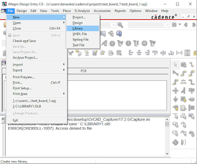
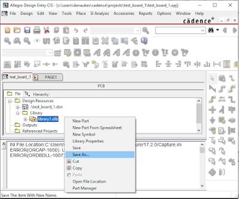
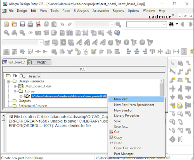

## Working with Libraries - THIS IS A DUPLICATE TUTORIAL

This tutorial details how to add and save a custom library.

1.  Open an existing project or create a new project if you are starting from scratch

2.  Go to "file-->new-->library". A new library will be created and added to your project.

[{class="img-fluid"}](larger/image0262.png)

3.  In the project explorer window, navigate to the newly created library, and right click on it to "save as…"

[{class="img-fluid"}](larger/image0263.png)

4.  Select the location you would like to save your parts library. This library can be used over and over in multiple projects, so the best place to store it is in one of your top level cadence folders.

5.  Create a new part in the library by right clicking on it and selecting "new part". A dialog will open that will allow you to define a new part and start designing it.

[{class="img-fluid"}](larger/image0264.png)
