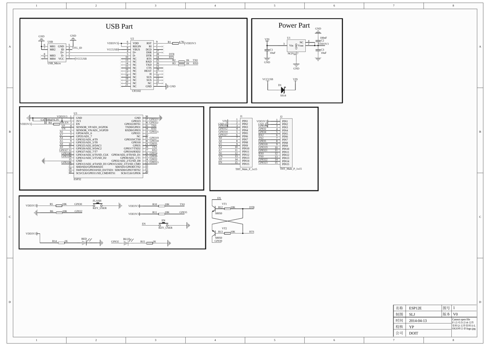

## TL/DR
<div class="alert alert-warning" role="alert">
RX0 / TX0 are used by the onboard silabs USB/serial chip and shouldn't be used for UART in your project
</div>


## Pinouts / Schematics




### External Pinout Resources

* <https://johnmu.com/picking-esp32-dev-board/>
* <https://www.etechnophiles.com/esp32-dev-board-pinout-specifications-datasheet-and-schematic/>
* <https://www.studiopieters.nl/esp32-pinout/>

## MicroPython

* MicroPython for ESP32 [firmware download page](https://micropython.org/download/esp32/)
* ESP32 Micropython Documentation 
    * [quickref](https://docs.micropython.org/en/latest/esp32/quickref.html)

## Thonny (IDE)

* Must [install anaconda python](/installing-anaconda-python)
* once you have, 

    ```bash
    pip install esptool thonny
    ```
