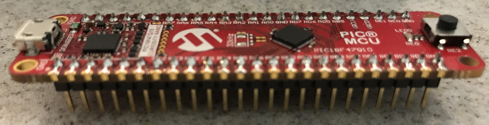

# Introduction

Many sensors have an analog output that must be digitized using an Analog to Digital converter (ADC) in order to use them in a microcontroller. The PIC's ADC subsystem is the peripheral used to read analog values and convert it into a digital number for use in your program. It can be configured in a variety of ways. In this assignment, you will create an ADC subsystem and program your microcontroller to transmit the result of reading an analog voltage measured at an input pin, using the ADC subsystem in one of its simplest configurations.

Likewise, PWM signals are often used to control a variety of actuators (e.g., servo motors), and, because they provide a proportional time-based signal, can be used in certain circumstances, as an analog output from a microcontroller. In this assignment, you will also program your microcontroller to generate a PWM signal using the measured ADC value, and demonstrate modifying the output of the PWM signal in two key ways.

The goal of this assignment is to introduce you to the MPLAB® X IDE, and to verify that you can create a project, add peripherals (ADC, PWM, EUSART), and use them together. By the end of this assignment you should be able to demonstrate proficiency in:

1.  Configuring your microcontroller to send data across a virtual COM port to your PC.
2.  Measuring an analog voltage using an analog to digital converter
3.  Outputting the measured ADC value over EUSART
4.  Converting an ADC value to Voltage and outputting the result over EUSART
5.  Changing a pulse-width modulation (PWM) signal
    a.  With a specific duty cycle from your microcontroller output pin.
    b.  By changing the frequency of the cycle itself


# Resources

-   [*PIC18F47Q10 Datasheet*](https://ww1.microchip.com/downloads/en/DeviceDoc/PIC18F27-47Q10-Data-Sheet-40002043E.pdf)
-   [*PIC18F47Q10 Curiosity Nano*](https://www.microchip.com/Developmenttools/ProductDetails/DM182029) Microchip Main Page
    -   [*Hardware User Guide*](https://ww1.microchip.com/downloads/en/DeviceDoc/PIC18F47Q10-Curiosity-Nano-Hardware-User-Guide-40002103B.pdf)
    -   [*Design Documentation*](https://ww1.microchip.com/downloads/en/DeviceDoc/PIC18F47Q10-CNANO_Design_Documentation_Rev5.zip)
    -   [*Schematic*](https://ww1.microchip.com/downloads/en/DeviceDoc/PIC18F47Q10-CNANO_Schematics.pdf)
    -   [*Microchip tutorial & example*](http://ww1.microchip.com/downloads/en/Appnotes/Getting-Started-with-UART-Using-EUSART-on-PIC18-90003282A.pdf)
-   [*XC8 Compiler Documentation*](http://ww1.microchip.com/downloads/en/DeviceDoc/MPLAB_XC8_C_Compiler_User_Guide_for_PIC.pdf)
-   Microchip developer [*tutorials site*](https://microchipdeveloper.com/)
-   Analog and ADC's
    -   Analog input - Scherz & Monk, Chapter 13.5.2
    -   [*ADC and LCD with MPLAB Code Configurator*](https://www.youtube.com/watch?v=4WaB_Lj8FnY&list=PL3lfkED2i6JcJH-OETxsI43e8M-7eLeL-&index=22) video
    -   [*PIC18F47Q10 Datasheet*](https://ww1.microchip.com/downloads/en/DeviceDoc/PIC18F27-47Q10-Data-Sheet-40002043E.pdf), section X.Y.Z on ADC^2^
-   Pulse Width Modulation (PWM)
    -   Pulse-width modulation - Scherz & Monk, Chapter 13.5.3, 14.4,
    -   [PWM Tutorial from AfroTechMods.com](http://www.afrotechmods.com/groovy/PWM_tutorial/PWM_tutorial.htm)
-   Potentiometers - Scherz & Monk, Chapter 3.5.6 and 3.5.7
-   Software
    -   [*PuTTY*](https://www.chiark.greenend.org.uk/~sgtatham/putty/latest.html) (Windows)
-   C Information
    -   [*GNU C Reference Manual*](https://www.gnu.org/software/gnu-c-manual/gnu-c-manual.html)
    -   tutorial on [*type casting*](https://www.tutorialspoint.com/cprogramming/c_type_casting.htm)
    -   article on [*bit shifting*](https://www.geeksforgeeks.org/left-shift-right-shift-operators-c-cpp/)

# Parts Needed

| **Item**                                                                                           | **Quantity** | **Value(s)**   |
|:---------------------------------------------------------------------------------------------------|:-------------|:---------------|
| [*PIC18F47Q10 Curiosity Nano*](https://www.microchip.com/Developmenttools/ProductDetails/DM182029) | 1            |                |
| Breadboard                                                                                         | 1            |                |
| Resistors                                                                                          | 1            | TBD by student |
| LED                                                                                                | 1            | Any color      |
| Jumper wires                                                                                       | Several      |                |

# Instructions

*You may use your Nano board or a breadboard with your microcontroller on it.*

1.  Using the [*Hardware User Guide*](https://ww1.microchip.com/downloads/en/DeviceDoc/PIC18F47Q10-Curiosity-Nano-Hardware-User-Guide-40002103B.pdf) and lessons learned last semester with connecting to the PSoC®, study the following critical information and concepts:


| **Critical Information and Concepts**                                                                                                                                                                                                                                                                                          | **Importance**                                                                                                                                                                                                             |
|:-------------------------------------------------------------------------------------------------------------------------------------------------------------------------------------------------------------------------------------------------------------------------------------------------------------------------------|:---------------------------------------------------------------------------------------------------------------------------------------------------------------------------------------------------------------------------|
| a.  The name of the virtual COM port that communicates over the Curiosity Nano's USB to your computer.                                                                                                                                                                                                                         | Needed in order to connect PuTTY to the Curiosity Nano                                                                                                                                                                     |
| b.  Which EUSART subsystem connects to it                                                                                                                                                                                                                                                                                      | Needed to determine which EUSART port to connect the PIC to in order to communicate with the debugger and computer                                                                                                         |
| c.  Which specific pins are used for receive and transmit on the PIC                                                                                                                                                                                                                                                           | Needed to assign the correct pins to the EUSART component                                                                                                                                                                  |
| d.  How much current can a digital I/O pin safely source or sink? (Hint: See the [*PIC18F47Q10 Datasheet*](https://ww1.microchip.com/downloads/en/DeviceDoc/PIC18F27-47Q10-Data-Sheet-40002043E.pdf))                                                                                                                          | Needed to match the current needs of external loads (e.g., LEDs) with the IC and determine whether you need interface circuitry (e.g., a transistor)                                                                       |
| e.  Which pin of the Curiosity Nano board outputs the regulated power used by the "target" (the PIC18F47Q10)                                                                                                                                                                                                                   | Needed to know where you can access power and ground on the Curiosity Nano board                                                                                                                                           |
| f.  Which pins of the Curiosity Nano connect to ground?                                                                                                                                                                                                                                                                        |                                                                                                                                                                                                                            |
| g.  How many bits wide is the result of an ADC read?<br>h.  How many bits wide is the PWM timer register?                                                                                                                                                                                                                      | Needed to read, interpret, and write data to and from the ADC and PWM peripherals. Can be found in the [*PIC18F47Q10 Datasheet*](https://ww1.microchip.com/downloads/en/DeviceDoc/PIC18F27-47Q10-Data-Sheet-40002043E.pdf) |
| i.  How to shift bits of a number or variable (needed to manipulate data in an 8-bit variable)<br>j.  How to mask bits of a number or variable (needed to read or write specific bits in an 8-bit variable)<br>k.  How to cast a variable as a different data type (needed to convert variables from one data type to another) | Needed to manipulate data in variables. Can be found in a C programming reference, such as the [*GNU C Reference Manual*](https://www.gnu.org/software/gnu-c-manual/gnu-c-manual.html)                                     |

2.  Open the Curiosity Nano box and the two antistatic bags inside. Solder the headers into the PCB so that the long side can be plugged into a breadboard and the short side goes through the PCB and can be soldered on the top. 

    

3.  Follow the instructions in the Quick Start section of the [*Hardware User Guide*](https://ww1.microchip.com/downloads/en/DeviceDoc/PIC18F47Q10-Curiosity-Nano-Hardware-User-Guide-40002103B.pdf) to download and install the MPLAB® X IDE (including IPE and 8 bit MCU support), XC8 compiler, and MPLAB® Code Configurator (MCC). *Note: The free compiler license is sufficient for this course.*

4.  Open MPLAB® X IDE and plug the Curiosity Nano board into the USB port of your computer

5.  In MPLAB X, create a new project for the PIC18F47Q10

    a.  Ensure the curiosity nano is connected over usb before starting project setup so you can select it as the programming "tool" during setup.

6.  Open MCC, and select the default file location when prompted.

7.  Open the project in MPLAB® X and MCC, then add and configure the following peripherals:
    1.  System Module:
        1.  select the HFINTOSC (high frequency internal oscillator) at 4 MHz.
        1. Keep the clock divisions at 4.
        1. disable the Watchdog timer
    1.  EUSARTX
        1.  Add and configure a new EUSART peripheral (the one that connects to USB). Make sure you check the "connect to stdio" box.
    1.  ADCC
        1.  Ensure right result alignment (this means the data is right-justified in the result register)
        1. Do not select continuous operation
        1. Keep all other defaults
    1.  PWMX
        1.  Note the Timer Source (you will need this for the next step)
        1. Set the initial duty cycle to 50%
        1. Keep all other defaults
    1.  TMRX, where X is a specific timer that must be matched to the PWM subsystem selected.
        1.  Use the FOSC/4 setting (you will get an error otherwise).
        1. Use the highest prescaling possible (to ensure the timer counts slowly)
        1. Set the timer period to the maximum possible (to further slow down the count so that the LED blinks slowly)
        1. Keep all other defaults

    ***Pay attention to and follow all instructions provided by the MCC's warnings and errors in the Notifications \[MCC\] window***

8.  Open up the pin manager grid
    1.  Ensure that RX and TX are mapped to the correct pins (as you found it from the HW User Guide's pinout section in the previous step).
    1.  Select an analog input pin (ANx)
    1.  Select a pin that connects to PWMX
9.  In the Pin settings(in the resources window), ensure that
    1.  your RX pin is set to a digital input (leave the analog option unchecked)
    1.  your TX pin is set to a digital output (leave the analog option unchecked)
    1.  the second TX pin (for the external LED) is set to a digital output (leave the analog option unchecked)
    1.  the PWMX pin is set as a digital output (leave "analog" unchecked)
    1.  that the ADCX pin is marked as an analog input.
10. Generate the MCC configuration
11. Open EUSARTX.h (where "X" is the correct EUSART peripheral) in the MCC-generated header files within the project explorer. Read through this document, Identify each function and determine what the purpose of each is. Then find the function that initializes this EUSART subsystem and note it.
12. Open up ADCX.h
    1.  Find the function that permits you read a single ADC value (conversion). Copy the example code into main.c
        1.  *Hint:* Pay attention to the number of bits in adc_result_t in the typedef statement. This will be important later.
        1. *Note:* The example code has an error. The following line:
            
            ```c
            adcX_channel_t convertedValue;
            ```
            
            should be as follows instead:
            
            ```c
            adc_result_t convertedValue;
            ```

    1.  Find the declared constant for the ADC input pin you have configured (hint: check the Pin Module). Supply this value as the input to the ADC single-read function.
    1.  You will need to define a new variable to use the output of this function. Refer to the commented out example code to determine the appropriate data type for the variable.
13. Open up PWMX.h
    1.  Find the function that permits you to set the duty cycle. Copy the example code into main.c
    1.  You will need to define a new variable to use the output of this function. Refer to the commented out example code to determine the appropriate datatype.
14. Open up TMRX.h
    1.  Find the function that permits you to set the period register. Copy the example code into main.c but leave it commented out for now
    1.  You will need to define a new variable to use the output of this function. Refer to the commented out example code to determine the appropriate datatype. Add a new line of code for using the ADC value you read and converted previously to change the PWM duty cycle.
15. Now tie these new functions together into your main.c:
    1.  Add a new line of code to read a single value from the ADC and store it in a variable of the correct type. Refer to the adc subsystem header file generated by MCC to find the correct data type.
    1.  Next, add a new line of code to output the data stored in that variable to EUSART using printf(). Make sure to add carriage return and newline characters to clean up your transmission so that each new ADC value is output on a new line in Putty.

        *Hint:* Remember that X bit variables will have values between 0 and 2^X^-1. If you are printing numbers outside of that range then something is incorrect with your conversion. See Microchip's documentation on [*printf*](https://microchipdeveloper.com/tls2101:printf)() for more information.

    1.  Next, add a new variable with type *float* and use it to translate the integer ADC value to a decimal value that represents the voltage read on the ADC pin. Output that floating point value using the printf() function and the format specifier section of the printf()documentation linked in the previous step and as seen in the MPLABX tutorial. Your data should print on two lines, e.g.:

        ```
        ADC value: 255
        ADC voltage: 3.300
        ```

        *NOTE:* This may require a brush up on data types and [*converting*](https://www.oreilly.com/library/view/c-in-a/0596006977/ch04.html) or [*type casting*](https://www.tutorialspoint.com/cprogramming/c_type_casting.htm) from int to float in C.

    1.  Add a new line of code for using the ADC value you read and converted previously to change the PWM duty cycle. This is the raw ADC value before you converted it again to voltage.

        *Context:* Changing the duty cycle changes the *percentage* of the time a square wave is low or high. Variable duty cycles are often used for driving RC Servos or \-- in conjunction with a low pass filter \-- for approximating a simple and low-fidelity digital to analog converter(DAC).
        
        Ensure you are converting the X-bit ADC value to a properly-formatted Y-bit duty cycle value. (Though the functions that operate on these two registers accept 16-bit variables, they only use the least significant / bottom X and Y bits of each 16-bit variable). The information about the size of X and Y was found by you in the first steps of this assignment.

        *More Context:* The X-bit resolution(see [*PIC18F47Q10 Datasheet*](https://ww1.microchip.com/downloads/en/DeviceDoc/PIC18F27-47Q10-Data-Sheet-40002043E.pdf)) ADC result is stored in a 16-bit variable of type adc_result_t, which is wider (more bits) than the resolution of the ADC result. Furthermore, the PWM duty cycle register holds fewer bits than the resolution of the ADC. Thus, we want to transfer the [*most significant bits*](https://en.wikipedia.org/wiki/Bit_numbering) of the ADC's reading into the PWM's duty cycle register. The least significant bits of the ADC represent such a small difference in the final result that they can be truncated (cut off).

        Write a line of code that uses a C [*bit shifting*](https://www.tutorialspoint.com/cprogramming/c_bitwise_operators.htm) operator to shift the ADC result so that the most significant 8 bits of the ADC's output are used as an input to the PWM subsystem's duty cycle update function (look in the PWM header file). Be sure to "cast" this variable into the correct type declared by that function.\

        After shifting, the lower 8 bits of your adc_result_t variable should look like this (where x is the number of resolution bits for the ADC):

|     |          |          |          |          |          |          |          |          |
|:----|:---------|:---------|:---------|:---------|:---------|:---------|:---------|:---------|
| ... | ADC~x-1~ | ADC~x-2~ | ADC~x-3~ | ADC~x-4~ | ADC~x-5~ | ADC~x-6~ | ADC~x-7~ | ADC~x-8~ |

16. Download the project to the target. This can be done *one of two ways*
    1.  Using the download button (ensure you are connected to the Curiosity Nano board rather than the simulator, and that you have selected the Curiosity Nano as the programming "tool".)
    1.  Copying the .hex file from project-name/dist/production/project-name.hex to the "Curiosity" drive in file explorer.
17. Add a potentiometer to your system
    1.  Connect the wiper pin of a potentiometer to the analog input pin
    1.  Connect the other two pins of the potentiometer to the Curiosity Nano's regulated 3.3V power and ground (see the power supply section of the [*Hardware User Guide*](https://ww1.microchip.com/downloads/en/DeviceDoc/PIC18F47Q10-Curiosity-Nano-Hardware-User-Guide-40002103B.pdf) for more information, and verify with your DMM prior to connecting the potentiometer).
18. Add an **external** LED & resistor to the PWM output pin so that the LED *safely* turns on whenever the PWM output is high. (safely means that neither the LED nor the microcontroller pin burns out. Select an appropriate current-limiting resistor based on the LED specifications and the PIC18F47Q10 maximum pin current in the [*Datasheet*](https://ww1.microchip.com/downloads/en/DeviceDoc/PIC18F27-47Q10-Data-Sheet-40002043E.pdf))
19. Demonstrate that the voltage read by the ADC can be used to alter the duty cycle of the PWM signal.


